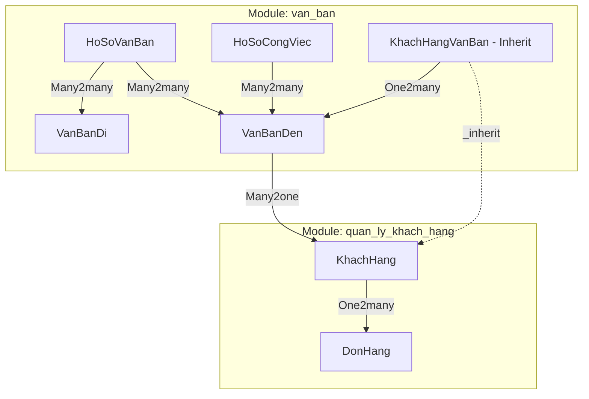
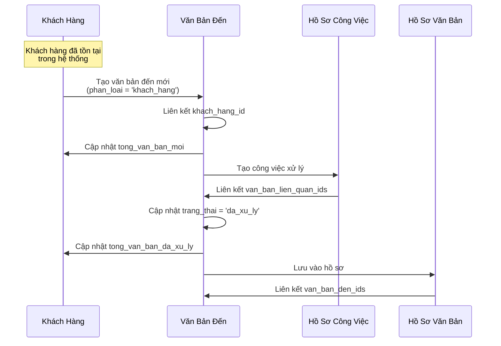
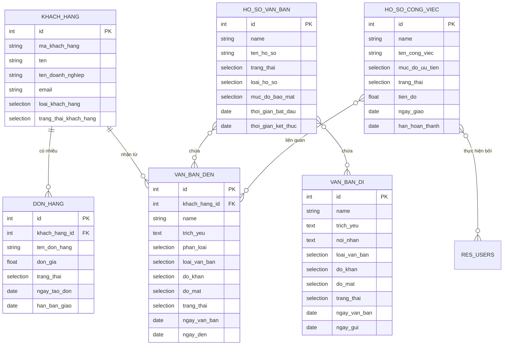

# Cố lên
  
> **tiêu đề:** giải thích

---
## Mục Lục

1. [Tổng Quan Hệ Thống](#1-tổng-quan-hệ-thống)
2. [Module 1: quan_ly_khach_hang](#2-module-1-quan_ly_khach_hang)
   - [2.1. Thông Tin Module](#21-thông-tin-module)
   - [2.2. Model: KhachHang](#22-model-khachhang)
   - [2.3. Model: DonHang](#23-model-donhang)
   - [2.4. Giao Diện Người Dùng](#24-giao-diện-người-dùng)
3. [Module 2: van_ban](#3-module-2-van_ban)
   - [3.1. Thông Tin Module](#31-thông-tin-module)
   - [3.2. Model: VanBanDen](#32-model-vanbanden)
   - [3.3. Model: VanBanDi](#33-model-vanbandi)
   - [3.4. Model: HoSoVanBan](#34-model-hosovanban)
   - [3.5. Model: HoSoCongViec](#35-model-hosocongviec)
   - [3.6. Models Danh Mục](#36-models-danh-mục)
   - [3.7. Giao Diện Người Dùng](#37-giao-diện-người-dùng)
4. [Phân Tích Tích Hợp Giữa Hai Module](#4-phân-tích-tích-hợp-giữa-hai-module)
   - [4.1. Kiến Trúc Tích Hợp](#41-kiến-trúc-tích-hợp)
   - [4.2. Quy Trình Nghiệp Vụ](#42-quy-trình-nghiệp-vụ)
   - [4.3. Phân Tích Mã Nguồn Tích Hợp](#43-phân-tích-mã-nguồn-tích-hợp)
5. [Sơ Đồ Quan Hệ Dữ Liệu](#5-sơ-đồ-quan-hệ-dữ-liệu)

---

## 1. Tổng Quan Hệ Thống

Hệ thống bao gồm hai module Odoo 15 tùy chỉnh hoạt động phối hợp với nhau:

| Module | Mô Tả | Phụ Thuộc |
|--------|-------|-----------|
| `quan_ly_khach_hang` | Quản lý thông tin khách hàng và đơn hàng | `base` |
| `van_ban` | Quản lý văn bản đến/đi, hồ sơ công việc | `base`, `quan_ly_khach_hang` |

> [!IMPORTANT]
> Module `van_ban` phụ thuộc vào `quan_ly_khach_hang`, nghĩa là `quan_ly_khach_hang` phải được cài đặt trước khi cài đặt `van_ban`.

### 1.1. Tóm Tắt Chức Năng Module

#### Module `quan_ly_khach_hang`

Module cung cấp giải pháp quản lý khách hàng và đơn hàng toàn diện:

| Chức Năng | Mô Tả |
|-----------|-------|
| **Quản lý thông tin khách hàng** | Lưu trữ thông tin cá nhân/doanh nghiệp, phân loại khách hàng mới/cũ |
| **Tự động sinh mã khách hàng** | Tạo mã từ tên và tên doanh nghiệp, hỗ trợ nhập tay |
| **Quản lý đơn hàng** | Theo dõi vòng đời đơn hàng: Mới → Đã giao / Đã hủy |
| **Thống kê tự động** | Computed fields tính tổng đơn theo trạng thái, tổng giao dịch |
| **Dashboard khách hàng** | Biểu đồ (Graph) và bảng phân tích (Pivot) thống kê khách hàng |
| **Dashboard đơn hàng** | Kanban board theo dõi đơn hàng theo trạng thái, hỗ trợ kéo thả |
| **Bộ lọc nâng cao** | Tìm kiếm theo loại khách hàng, trạng thái; nhóm theo tiêu chí |

#### Module `van_ban`

Module quản lý văn bản hành chính và công việc:

| Chức Năng | Mô Tả |
|-----------|-------|
| **Văn bản đến** | Tiếp nhận, phân loại (nội bộ/khách hàng), theo dõi xử lý |
| **Văn bản đi** | Soạn thảo, phê duyệt, gửi đi theo quy trình |
| **Hồ sơ văn bản** | Lưu trữ, phân loại văn bản theo hồ sơ |
| **Hồ sơ công việc** | Giao việc, theo dõi tiến độ, đánh giá kết quả |
| **Dashboard văn bản** | Kanban board theo dõi văn bản theo trạng thái, hiển thị độ khẩn |
| **Liên kết khách hàng** | Gắn văn bản với khách hàng, thống kê văn bản theo khách |
| **Hệ thống danh mục** | Quản lý đơn vị, chức vụ, loại văn bản, độ mật, độ khẩn |

---

## 2. Module 1: quan_ly_khach_hang

### 2.1. Thông Tin Module

| Thuộc Tính | Giá Trị |
|------------|---------|
| **Tên kỹ thuật** | `quan_ly_khach_hang` |
| **Tên hiển thị** | Quản lý khách hàng |
| **Phiên bản** | 0.1 |
| **Danh mục** | Sales |
| **Phụ thuộc** | `base` |

**Cấu trúc thư mục:**
```
quan_ly_khach_hang/
├── __init__.py
├── __manifest__.py
├── models/
│   ├── __init__.py
│   ├── khach_hang.py      # Model khách hàng
│   └── don_hang.py        # Model đơn hàng
├── security/
│   ├── security.xml
│   └── ir.model.access.csv
└── views/
    ├── khach_hang_views.xml
    ├── don_hang_views.xml
    └── menu_views.xml
```

---

### 2.2. Model: KhachHang

**Tên kỹ thuật:** `quan_ly_khach_hang.khach_hang`  
**Mô tả:** Lưu trữ thông tin khách hàng và các chỉ số tổng hợp đơn hàng

#### 2.2.1. Bảng Chi Tiết Các Fields

| Field Name | Kiểu Dữ Liệu | Bắt Buộc | Mô Tả |
|------------|--------------|----------|-------|
| `ma_khach_hang` | Char | ✅ | Mã khách hàng (tự động sinh hoặc nhập tay) |
| `ma_khach_hang_tu_nhap` | Boolean | - | Cờ đánh dấu mã khách hàng được nhập thủ công |
| `ten` | Char | ✅ | Tên khách hàng |
| `ten_doanh_nghiep` | Char | - | Tên doanh nghiệp (nếu là khách hàng doanh nghiệp) |
| `email` | Char | - | Địa chỉ email liên hệ |
| `loai_khach_hang` | Selection | ✅ | Phân loại: `ca_nhan` (Cá nhân) / `doanh_nghiep` (Doanh nghiệp) |
| `trang_thai_khach_hang` | Selection | ✅ | Trạng thái: `cu` (Cũ) / `moi` (Mới) |
| `don_hang_ids` | One2many | - | Danh sách đơn hàng liên kết → `quan_ly_khach_hang.don_hang` |
| `tong_don_cho_xu_ly` | Integer | - | **Computed** - Tổng đơn đang chờ xử lý |
| `tong_don_da_giao` | Integer | - | **Computed** - Tổng đơn đã giao |
| `tong_don_da_huy` | Integer | - | **Computed** - Tổng đơn đã hủy |
| `tong_giao_dich` | Float | - | **Computed** - Tổng giá trị giao dịch (chỉ tính đơn đã giao) |

#### 2.2.2. Logic Nghiệp Vụ

##### Tự động sinh mã khách hàng

```python
def _generate_ma_khach_hang(self):
    """
    Tạo mã khách hàng tự động từ:
    - Chữ cái đầu của mỗi từ trong tên (viết thường)
    - Ghép nối các từ trong tên doanh nghiệp (viết hoa)
    
    Ví dụ: ten="Nguyen Van A", ten_doanh_nghiep="ABC Corp"
    → ma_khach_hang = "nva_ABCCORP"
    """
    ma_ten = ''.join(phan[0] for phan in ten.lower().split() if phan)
    ma_dn = ''.join(phan for phan in ten_doanh_nghiep.upper().split() if phan)
    if ma_ten and ma_dn:
        return f"{ma_ten}_{ma_dn}"
    return ma_ten or ma_dn
```

##### Computed Fields - Tổng hợp đơn hàng

```python
@api.depends('don_hang_ids.trang_thai', 'don_hang_ids.don_gia')
def _compute_tong_hop_don_hang(self):
    """
    Tính toán các chỉ số tổng hợp từ danh sách đơn hàng:
    - Đếm số đơn theo từng trạng thái
    - Tính tổng giá trị từ các đơn đã giao
    """
    for record in self:
        don_hang = record.don_hang_ids
        don_cho = don_hang.filtered(lambda d: d.trang_thai == 'moi_cho_xu_ly')
        don_giao = don_hang.filtered(lambda d: d.trang_thai == 'da_giao')
        don_huy = don_hang.filtered(lambda d: d.trang_thai == 'da_huy')

        record.tong_don_cho_xu_ly = len(don_cho)
        record.tong_don_da_giao = len(don_giao)
        record.tong_don_da_huy = len(don_huy)
        record.tong_giao_dich = sum(don_giao.mapped('don_gia'))
```

> [!NOTE]
> Các computed fields được đánh dấu `store=True`, nghĩa là giá trị sẽ được lưu vào database và tự động cập nhật khi các trường phụ thuộc thay đổi.

---

### 2.3. Model: DonHang

**Tên kỹ thuật:** `quan_ly_khach_hang.don_hang`  
**Mô tả:** Lưu trữ thông tin đơn hàng của khách hàng

#### 2.3.1. Bảng Chi Tiết Các Fields

| Field Name | Kiểu Dữ Liệu | Bắt Buộc | Mô Tả |
|------------|--------------|----------|-------|
| `ten_don_hang` | Char | ✅ | Tên đơn hàng (dùng làm `_rec_name`) |
| `khach_hang_id` | Many2one | ✅ | Liên kết tới khách hàng → `quan_ly_khach_hang.khach_hang` |
| `ten_khach_hang` | Char | - | **Related** từ `khach_hang_id.ten` |
| `ma_khach_hang` | Char | - | **Related** từ `khach_hang_id.ma_khach_hang` |
| `ten_doanh_nghiep` | Char | - | **Related** từ `khach_hang_id.ten_doanh_nghiep` |
| `email` | Char | - | **Related** từ `khach_hang_id.email` |
| `don_gia` | Float | ✅ | Đơn giá (độ chính xác: 16,2) |
| `trang_thai` | Selection | ✅ | Trạng thái đơn hàng |
| `ngay_tao_don` | Date | ✅ | Ngày tạo đơn (mặc định: ngày hiện tại) |
| `han_ban_giao` | Date | - | Hạn bàn giao |

#### 2.3.2. Giá Trị Selection - Trạng Thái Đơn Hàng

| Giá Trị Kỹ Thuật | Nhãn Hiển Thị |
|------------------|---------------|
| `moi_cho_xu_ly` | Mới (chờ xử lí) |
| `da_giao` | Đã giao |
| `da_huy` | Đã hủy |

#### 2.3.3. Related Fields - Cơ Chế Hoạt Động

```python
ten_khach_hang = fields.Char(
    string='Tên khách hàng',
    related='khach_hang_id.ten',  # Lấy giá trị từ field 'ten' của khach_hang_id
    store=True,                    # Lưu vào database để tăng hiệu suất query
    readonly=True                  # Chỉ đọc, không cho phép sửa trực tiếp
)
```

> [!TIP]
> **Related fields** với `store=True` tạo bản copy dữ liệu trong database, cho phép tìm kiếm và sắp xếp nhanh hơn. Dữ liệu được tự động đồng bộ khi record gốc thay đổi.

---

### 2.4. Giao Diện Người Dùng

#### 2.4.1. Dashboard Khách Hàng


Dashboard cung cấp các view phân tích:

| View | Mô Tả |
|------|-------|
| **Graph View** | Biểu đồ cột thống kê tổng giao dịch và số đơn đã giao theo khách hàng |
| **Pivot View** | Bảng phân tích đa chiều: loại khách hàng (hàng), trạng thái (cột), các chỉ số (tổng giao dịch, số đơn) |

**Menu truy cập:** Quản lý khách hàng → Dashboard khách hàng

#### 2.4.2. Dashboard Đơn Hàng


Dashboard sử dụng Kanban board với các tính năng:

- **Nhóm theo trạng thái:** Các cột Mới, Đã giao, Đã hủy
- **Kanban Card:** Hiển thị tên đơn, đơn giá, tên khách hàng, ngày tạo, hạn bàn giao
- **Kéo thả:** Di chuyển đơn hàng giữa các trạng thái

**Menu truy cập:** Quản lý khách hàng → Dashboard đơn hàng

#### 2.4.3. Search View với Bộ Lọc

**Khách hàng:**
| Filter | Domain |
|--------|--------|
| Khách mới | `[('trang_thai_khach_hang', '=', 'moi')]` |
| Khách cũ | `[('trang_thai_khach_hang', '=', 'cu')]` |
| Cá nhân | `[('loai_khach_hang', '=', 'ca_nhan')]` |
| Doanh nghiệp | `[('loai_khach_hang', '=', 'doanh_nghiep')]` |

**Đơn hàng:**
| Filter | Domain |
|--------|--------|
| Mới | `[('trang_thai', '=', 'moi_cho_xu_ly')]` |
| Đã giao | `[('trang_thai', '=', 'da_giao')]` |
| Đã hủy | `[('trang_thai', '=', 'da_huy')]` |

**Group By:** Trạng thái, Khách hàng, Ngày tạo

#### 2.4.4. View Danh Sách & Form

**Tree View Khách Hàng** hiển thị: Mã, Tên, Doanh nghiệp, Email, Loại, Trạng thái, Thống kê đơn hàng

**Form View Khách Hàng:**
```
┌─────────────────────────────────────────────────────────────┐
│ THÔNG TIN CHUNG                                             │
├───────────────────────────┬─────────────────────────────────┤
│ Mã khách hàng             │ Loại khách hàng                 │
│ Tên khách hàng            │ Trạng thái khách hàng           │
│ Tên doanh nghiệp          │                                 │
│ Email                     │                                 │
├───────────────────────────┴─────────────────────────────────┤
│ TỔNG HỢP ĐƠN HÀNG                                           │
├───────────────────────────┬─────────────────────────────────┤
│ Tổng đơn chờ xử lý        │ Tổng giao dịch                  │
│ Tổng đơn đã giao          │                                 │
│ Tổng đơn đã hủy           │                                 │
├───────────────────────────┴─────────────────────────────────┤
│ [TAB: Đơn hàng]                                             │
│ ┌─────────────────────────────────────────────────────────┐ │
│ │ Tên đơn hàng | Đơn giá | Trạng thái | Ngày tạo | Hạn    │ │
│ └─────────────────────────────────────────────────────────┘ │
└─────────────────────────────────────────────────────────────┘
```

---

## 3. Module 2: van_ban

### 3.1. Thông Tin Module

| Thuộc Tính | Giá Trị |
|------------|---------|
| **Tên kỹ thuật** | `van_ban` |
| **Phiên bản** | 0.1 |
| **Danh mục** | Uncategorized |
| **Phụ thuộc** | `base`, `quan_ly_khach_hang` |

**Cấu trúc thư mục:**
```
van_ban/
├── __init__.py
├── __manifest__.py
├── controllers/
├── models/
│   ├── __init__.py
│   ├── van_ban_den.py          # Văn bản đến
│   ├── van_ban_di.py           # Văn bản đi
│   ├── ho_so_van_ban.py        # Hồ sơ văn bản
│   ├── ho_so_cong_viec.py      # Hồ sơ công việc
│   ├── danh_muc.py             # Các danh mục hệ thống
│   └── khach_hang_van_ban.py   # Mở rộng model khách hàng
├── security/
└── views/
    ├── van_ban_den_views.xml
    ├── van_ban_di_views.xml
    ├── ho_so_van_ban_views.xml
    ├── ho_so_cong_viec_views.xml
    ├── danh_muc_views.xml
    ├── khach_hang_views.xml    # View inherit
    └── menu_views.xml
```

---

### 3.2. Model: VanBanDen

**Tên kỹ thuật:** `van_ban_den`  
**Mô tả:** Quản lý văn bản đến từ bên ngoài

#### 3.2.1. Bảng Chi Tiết Các Fields

| Field Name | Kiểu Dữ Liệu | Bắt Buộc | Mô Tả |
|------------|--------------|----------|-------|
| `company_id` | Many2one | - | Liên kết công ty → `res.company` |
| `phan_loai` | Selection | - | Phân loại: `noi_bo` / `khach_hang` |
| `khach_hang_id` | Many2one | Điều kiện | Liên kết khách hàng → `quan_ly_khach_hang.khach_hang` |
| `name` | Char | ✅ | Số văn bản |
| `trich_yeu` | Text | ✅ | Trích yếu nội dung |
| `ngay_van_ban` | Date | - | Ngày văn bản |
| `ngay_den` | Date | - | Ngày đến |
| `so_den` | Char | - | Số đến |
| `co_quan_ban_hanh` | Char | - | Cơ quan ban hành |
| `nguoi_ky` | Char | - | Người ký |
| `loai_van_ban` | Selection | - | Loại văn bản |
| `do_khan` | Selection | - | Độ khẩn |
| `do_mat` | Selection | - | Độ mật |
| `trang_thai` | Selection | - | Trạng thái xử lý |
| `file_dinh_kem` | Binary | - | File đính kèm |
| `file_name` | Char | - | Tên file |

#### 3.2.2. Giá Trị Selection

**Loại văn bản (`loai_van_ban`):**
| Giá Trị | Nhãn |
|---------|------|
| `quyet_dinh` | Quyết định |
| `cong_van` | Công văn |
| `thong_bao` | Thông báo |
| `ke_hoach` | Kế hoạch |
| `bao_cao` | Báo cáo |
| `to_trinh` | Tờ trình |
| `khac` | Khác |

**Độ khẩn (`do_khan`):**
| Giá Trị | Nhãn |
|---------|------|
| `thuong` | Thường |
| `khan` | Khẩn |
| `hoa_toc` | Hỏa tốc |

**Độ mật (`do_mat`):**
| Giá Trị | Nhãn |
|---------|------|
| `binh_thuong` | Bình thường |
| `mat` | Mật |
| `tuyet_mat` | Tuyệt mật |

**Trạng thái (`trang_thai`):**
| Giá Trị | Nhãn |
|---------|------|
| `moi` | Mới |
| `dang_xu_ly` | Đang xử lý |
| `da_xu_ly` | Đã xử lý |

---

### 3.3. Model: VanBanDi

**Tên kỹ thuật:** `van_ban_di`  
**Mô tả:** Quản lý văn bản đi gửi ra bên ngoài

#### 3.3.1. Bảng Chi Tiết Các Fields

| Field Name | Kiểu Dữ Liệu | Bắt Buộc | Mô Tả |
|------------|--------------|----------|-------|
| `company_id` | Many2one | - | Liên kết công ty |
| `name` | Char | ✅ | Số văn bản |
| `trich_yeu` | Text | ✅ | Trích yếu nội dung |
| `ngay_van_ban` | Date | - | Ngày văn bản |
| `ngay_gui` | Date | - | Ngày gửi |
| `so_di` | Char | - | Số đi |
| `noi_nhan` | Text | - | Nơi nhận |
| `nguoi_ky` | Char | - | Người ký |
| `loai_van_ban` | Selection | - | Loại văn bản (giống VanBanDen) |
| `do_khan` | Selection | - | Độ khẩn |
| `do_mat` | Selection | - | Độ mật |
| `trang_thai` | Selection | - | Trạng thái |
| `file_dinh_kem` | Binary | - | File đính kèm |
| `file_name` | Char | - | Tên file |

#### 3.3.2. Trạng Thái Văn Bản Đi

| Giá Trị | Nhãn | Mô Tả |
|---------|------|-------|
| `du_thao` | Dự thảo | Văn bản đang soạn thảo |
| `cho_duyet` | Chờ duyệt | Đã gửi chờ phê duyệt |
| `da_duyet` | Đã duyệt | Đã được phê duyệt |
| `da_gui` | Đã gửi | Đã gửi đi |

---

### 3.4. Model: HoSoVanBan

**Tên kỹ thuật:** `ho_so_van_ban`  
**Mô tả:** Quản lý hồ sơ lưu trữ văn bản

#### 3.4.1. Bảng Chi Tiết Các Fields

| Field Name | Kiểu Dữ Liệu | Bắt Buộc | Mô Tả |
|------------|--------------|----------|-------|
| `name` | Char | ✅ | Số hồ sơ |
| `ten_ho_so` | Char | ✅ | Tên hồ sơ |
| `ma_ho_so` | Char | - | Mã hồ sơ |
| `thoi_gian_bat_dau` | Date | - | Thời gian bắt đầu |
| `thoi_gian_ket_thuc` | Date | - | Thời gian kết thúc |
| `nguoi_lap` | Many2one | - | Người lập → `res.users` |
| `don_vi` | Char | - | Đơn vị |
| `trang_thai` | Selection | - | Trạng thái hồ sơ |
| `loai_ho_so` | Selection | - | Loại hồ sơ |
| `muc_do_bao_mat` | Selection | - | Mức độ bảo mật |
| `mo_ta` | Text | - | Mô tả |
| `ghi_chu` | Text | - | Ghi chú |
| `van_ban_den_ids` | Many2many | - | Văn bản đến trong hồ sơ |
| `van_ban_di_ids` | Many2many | - | Văn bản đi trong hồ sơ |
| `file_dinh_kem` | Binary | - | File đính kèm |

#### 3.4.2. Quan Hệ Many2many - Cấu Hình Chi Tiết

```python
van_ban_den_ids = fields.Many2many(
    'van_ban_den',                    # Model đích
    'ho_so_van_ban_den_rel',          # Tên bảng trung gian
    'ho_so_id',                       # Cột FK tới ho_so_van_ban
    'van_ban_den_id',                 # Cột FK tới van_ban_den
    string='Văn bản đến'
)

van_ban_di_ids = fields.Many2many(
    'van_ban_di',
    'ho_so_van_ban_di_rel',           # Bảng trung gian riêng biệt
    'ho_so_id',
    'van_ban_di_id',
    string='Văn bản đi'
)
```

> [!NOTE]
> Việc khai báo tường minh tên bảng trung gian (`relation`) giúp tránh xung đột tên khi có nhiều quan hệ Many2many tới các model khác nhau.

---

### 3.5. Model: HoSoCongViec

**Tên kỹ thuật:** `ho_so_cong_viec`  
**Mô tả:** Quản lý hồ sơ công việc và theo dõi tiến độ

#### 3.5.1. Bảng Chi Tiết Các Fields

| Field Name | Kiểu Dữ Liệu | Bắt Buộc | Mô Tả |
|------------|--------------|----------|-------|
| `name` | Char | ✅ | Mã công việc |
| `ten_cong_viec` | Char | ✅ | Tên công việc |
| `mo_ta` | Text | - | Mô tả công việc |
| `nguoi_giao` | Many2one | - | Người giao → `res.users` |
| `nguoi_thuc_hien` | Many2many | - | Danh sách người thực hiện |
| `nguoi_phoi_hop` | Many2many | - | Danh sách người phối hợp |
| `ngay_giao` | Date | - | Ngày giao việc |
| `han_hoan_thanh` | Date | - | Hạn hoàn thành |
| `ngay_hoan_thanh` | Date | - | Ngày hoàn thành thực tế |
| `muc_do_uu_tien` | Selection | - | Mức độ ưu tiên |
| `trang_thai` | Selection | - | Trạng thái công việc |
| `tien_do` | Float | - | Tiến độ (%) |
| `van_ban_lien_quan_ids` | Many2many | - | Văn bản đến liên quan |
| `ket_qua` | Text | - | Kết quả thực hiện |
| `nhan_xet` | Text | - | Nhận xét |

#### 3.5.2. Logic Tự Động Cập Nhật Tiến Độ

```python
@api.onchange('trang_thai')
def _onchange_trang_thai(self):
    """
    Tự động cập nhật tiến độ và ngày hoàn thành dựa trên trạng thái:
    - Nếu hoàn thành → tiến độ = 100%, ghi ngày hoàn thành
    - Nếu mới → tiến độ = 0%
    """
    if self.trang_thai == 'hoan_thanh':
        self.ngay_hoan_thanh = fields.Date.today()
        self.tien_do = 100
    elif self.trang_thai == 'moi':
        self.tien_do = 0
```

---

### 3.6. Models Danh Mục

Module `van_ban` định nghĩa 5 model danh mục hỗ trợ trong file [danh_muc.py](file:///wsl.localhost/Ubuntu-22.04/home/khuong/odoo-btl/TTDN-16-02-N8/addons/van_ban/models/danh_muc.py):

| Model | Tên Kỹ Thuật | Mô Tả |
|-------|--------------|-------|
| DonVi | `van_ban.don_vi` | Danh mục đơn vị |
| ChucVu | `van_ban.chuc_vu` | Danh mục chức vụ |
| LoaiVanBan | `van_ban.loai_van_ban` | Danh mục loại văn bản |
| DoMat | `van_ban.do_mat` | Danh mục độ mật |
| DoKhan | `van_ban.do_khan` | Danh mục độ khẩn |

**Cấu trúc chung của các model danh mục:**

| Field | Kiểu | Mô Tả |
|-------|------|-------|
| `name` | Char | Tên danh mục (bắt buộc) |
| `ma_*` | Char | Mã danh mục (bắt buộc) |
| `sequence` | Integer | Thứ tự sắp xếp |
| `active` | Boolean | Trạng thái hoạt động |
| `ghi_chu` | Text | Ghi chú |

---

### 3.7. Giao Diện Người Dùng

#### 3.7.1. Dashboard Văn Bản Đến


Dashboard sử dụng Kanban board với các tính năng nổi bật:

| Tính Năng | Mô Tả |
|-----------|-------|
| **Nhóm theo trạng thái** | Các cột: Mới, Đang xử lý, Đã xử lý |
| **Badge độ khẩn** | Hiển thị badge màu vàng (Khẩn), đỏ (Hỏa tốc) |
| **Thông tin khách hàng** | Hiển thị tên khách hàng nếu văn bản từ khách hàng |
| **Kanban Card** | Số văn bản, trích yếu, ngày đến |

**Menu truy cập:** Quản lý văn bản → Dashboard

```xml
<!-- Kanban template với badge độ khẩn -->
<span t-if="record.do_khan.raw_value == 'khan'" class="badge badge-warning">Khẩn</span>
<span t-if="record.do_khan.raw_value == 'hoa_toc'" class="badge badge-danger">Hỏa tốc</span>
```

#### 3.7.2. View Form Văn Bản Đến

View form có logic điều kiện hiển thị:

```xml
<field name="phan_loai" widget="radio"/>
<field name="khach_hang_id" 
       attrs="{
           'invisible': [('phan_loai', '!=', 'khach_hang')], 
           'required': [('phan_loai', '=', 'khach_hang')]
       }"/>
```

> [!TIP]
> Field `khach_hang_id` chỉ hiển thị và bắt buộc khi `phan_loai` = `'khach_hang'`. Đây là cách Odoo xử lý UI động dựa trên giá trị field.

#### 3.7.3. Search View với Filters

**Văn bản đến:**
| Filter | Domain |
|--------|--------|
| Mới | `[('trang_thai', '=', 'moi')]` |
| Đang xử lý | `[('trang_thai', '=', 'dang_xu_ly')]` |
| Đã xử lý | `[('trang_thai', '=', 'da_xu_ly')]` |
| Nội bộ | `[('phan_loai', '=', 'noi_bo')]` |
| Khách hàng | `[('phan_loai', '=', 'khach_hang')]` |

**Group By:** Trạng thái, Loại văn bản, Độ khẩn, Phân loại

---

## 4. Phân Tích Tích Hợp Giữa Hai Module

### 4.1. Kiến Trúc Tích Hợp



### 4.2. Quy Trình Nghiệp Vụ

#### Luồng Xử Lý Văn Bản Từ Khách Hàng



### 4.3. Phân Tích Mã Nguồn Tích Hợp

#### 4.3.1. Model Kế Thừa (Inheritance)

File [khach_hang_van_ban.py](file:///wsl.localhost/Ubuntu-22.04/home/khuong/odoo-btl/TTDN-16-02-N8/addons/van_ban/models/khach_hang_van_ban.py) sử dụng **Class Inheritance** để mở rộng model khách hàng:

```python
class KhachHangVanBan(models.Model):
    """Mở rộng model KhachHang để thêm liên kết với văn bản đến"""
    _inherit = 'quan_ly_khach_hang.khach_hang'

    # Thêm One2many field tới văn bản đến
    van_ban_den_ids = fields.One2many(
        'van_ban_den',
        'khach_hang_id',
        string='Văn bản đến'
    )

    # Thêm computed fields thống kê văn bản
    tong_van_ban_moi = fields.Integer(
        string='Tổng văn bản mới',
        compute='_compute_tong_hop_van_ban',
        store=True
    )
    # ... các computed fields khác
```

> [!IMPORTANT]
> **Cách hoạt động của `_inherit`:**
> - Không tạo model mới, mà thêm fields/methods vào model gốc
> - Model `quan_ly_khach_hang.khach_hang` sau khi cài `van_ban` sẽ có thêm các fields từ `KhachHangVanBan`
> - Đây là kỹ thuật quan trọng để module mở rộng chức năng mà không sửa code gốc

#### 4.3.2. Liên Kết Many2one Giữa Modules

Trong [van_ban_den.py](file:///wsl.localhost/Ubuntu-22.04/home/khuong/odoo-btl/TTDN-16-02-N8/addons/van_ban/models/van_ban_den.py):

```python
khach_hang_id = fields.Many2one(
    'quan_ly_khach_hang.khach_hang',  # Tham chiếu tới model ở module khác
    string='Khách hàng'
)
```

**Cơ chế ORM:**
- Odoo ORM tự động tìm model theo tên kỹ thuật
- Yêu cầu module `quan_ly_khach_hang` phải được cài trước (khai báo trong `depends`)
- Tạo foreign key trong database: `van_ban_den.khach_hang_id` → `quan_ly_khach_hang_khach_hang.id`

#### 4.3.3. View Inheritance - Mở Rộng Giao Diện

File [views/khach_hang_views.xml](file:///wsl.localhost/Ubuntu-22.04/home/khuong/odoo-btl/TTDN-16-02-N8/addons/van_ban/views/khach_hang_views.xml) trong module `van_ban` mở rộng form view của khách hàng:

```xml
<record id="view_khach_hang_form_inherit_van_ban" model="ir.ui.view">
    <field name="name">Khách hàng - Form - Văn bản</field>
    <field name="model">quan_ly_khach_hang.khach_hang</field>
    <field name="inherit_id" ref="quan_ly_khach_hang.view_khach_hang_form"/>
    <field name="arch" type="xml">
        <!-- Thêm group Tổng hợp văn bản sau group tong_giao_dich -->
        <xpath expr="//field[@name='tong_giao_dich']/.." position="after">
            <group string="Tổng hợp văn bản">
                <group>
                    <field name="tong_van_ban_moi" readonly="1"/>
                    <field name="tong_van_ban_dang_xu_ly" readonly="1"/>
                    <field name="tong_van_ban_da_xu_ly" readonly="1"/>
                </group>
            </group>
        </xpath>
        
        <!-- Thêm tab Văn bản đến sau tab Đơn hàng -->
        <xpath expr="//field[@name='don_hang_ids']/.." position="after">
            <page string="Văn bản đến">
                <field name="van_ban_den_ids">
                    <tree string="Văn bản đến">
                        <field name="name"/>
                        <field name="trich_yeu"/>
                        <field name="ngay_van_ban"/>
                        <field name="loai_van_ban"/>
                        <field name="trang_thai"/>
                    </tree>
                </field>
            </page>
        </xpath>
    </field>
</record>
```

**Kết quả:** Form khách hàng sau khi cài module `van_ban` sẽ có thêm:
- Nhóm "Tổng hợp văn bản" hiển thị thống kê
- Tab "Văn bản đến" liệt kê các văn bản liên quan

---

## 5. Sơ Đồ Quan Hệ Dữ Liệu

### 5.1. Entity Relationship Diagram



### 5.2. Tổng Kết Các Loại Quan Hệ

| Quan Hệ | Từ Model | Tới Model | Loại | Mô Tả |
|---------|----------|-----------|------|-------|
| `don_hang_ids` | KhachHang | DonHang | One2many | Danh sách đơn hàng của khách |
| `khach_hang_id` | DonHang | KhachHang | Many2one | Đơn hàng thuộc về khách |
| `van_ban_den_ids` | KhachHang | VanBanDen | One2many | Văn bản đến từ khách |
| `khach_hang_id` | VanBanDen | KhachHang | Many2one | Văn bản thuộc về khách |
| `van_ban_den_ids` | HoSoVanBan | VanBanDen | Many2many | Văn bản đến trong hồ sơ |
| `van_ban_di_ids` | HoSoVanBan | VanBanDi | Many2many | Văn bản đi trong hồ sơ |
| `van_ban_lien_quan_ids` | HoSoCongViec | VanBanDen | Many2many | Văn bản liên quan công việc |

---
> [!IMPORTANT]
> **Vậy là lần cuối đi bên nhau...**  
> Cay đắng nhưng không đau
