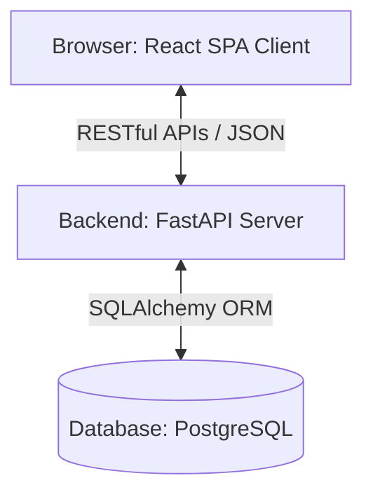
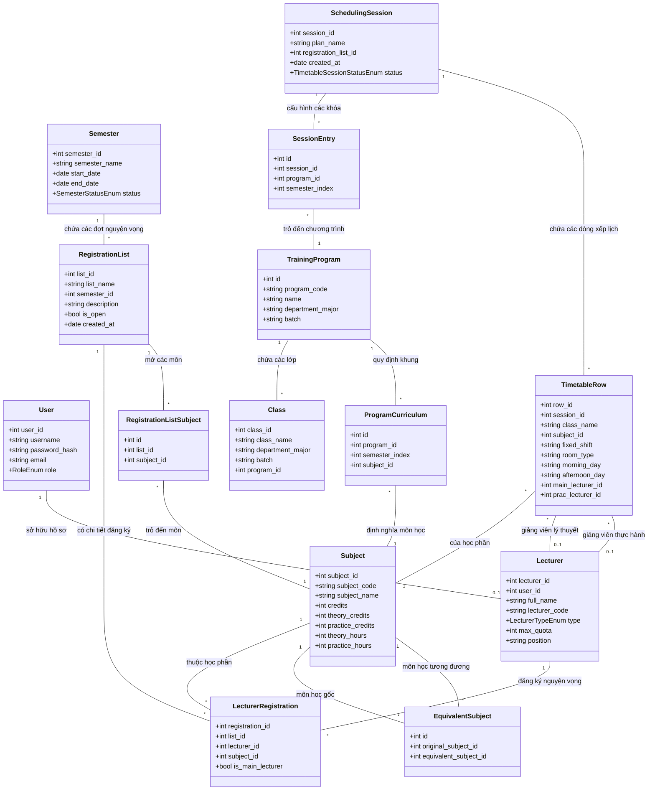
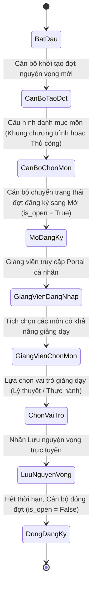
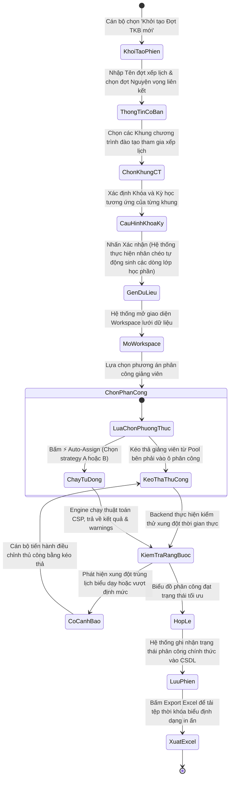
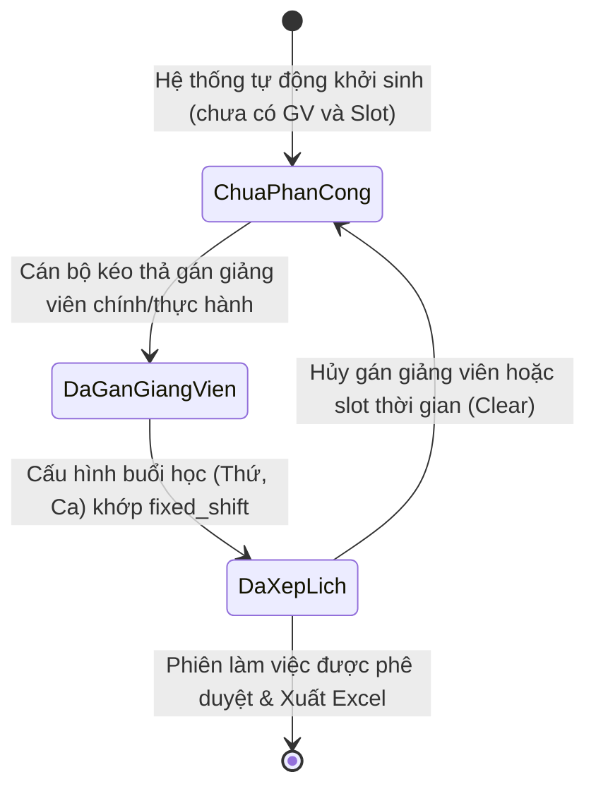

# CHƯƠNG 3. PHÂN TÍCH VÀ THIẾT KẾ HỆ THỐNG

## 3.1. Thiết kế hệ thống

Hệ thống lập kế hoạch và giảng dạy cho Khoa Công nghệ Thông tin – Trường Đại học Đại Nam được thiết kế theo mô hình kiến trúc Client-Server hiện đại. Sự phân tách rõ ràng giữa tầng giao diện người dùng (Frontend) và tầng xử lý nghiệp vụ trung tâm (Backend) giúp tối ưu hóa hiệu năng, tăng cường tính bảo mật và hỗ trợ khả năng nâng cấp độc lập cho từng thành phần. 

Sơ đồ kiến trúc tổng quan dưới đây thể hiện luồng giao tiếp dữ liệu giữa Client, API Server và Cơ sở dữ liệu:

```mermaid
graph TD
    Client[Browser: React SPA Client] <-->|RESTful APIs / JSON| API[Backend: FastAPI Server]
    API <-->|SQLAlchemy ORM| DB[(Database: PostgreSQL)]
```

*   **Tầng Máy trạm (Client - Frontend):** Được xây dựng dưới dạng ứng dụng Single Page Application (SPA) sử dụng React 19 và TypeScript. Tầng này chịu trách nhiệm hiển thị giao diện, tiếp nhận tương tác kéo thả của người dùng, thực hiện kiểm tra tính hợp lệ sơ bộ của dữ liệu và giao tiếp bất đồng bộ với Backend qua giao thức HTTP/HTTPS bằng các cuộc gọi API JSON.
*   **Tầng Máy chủ API (API Server - Backend):** Sử dụng FastAPI làm nền tảng phát triển API bất đồng bộ. Tầng này chịu trách nhiệm kiểm tra quyền truy cập (Authorization), thực thi các nghiệp vụ lõi (Business Logic), xử lý tệp tin Excel thông qua thư viện OpenPyXL, chạy động cơ phân công tự động dựa trên thuật toán Thỏa mãn Ràng buộc (CSP), và điều phối các giao dịch dữ liệu.
*   **Tầng Cơ sở dữ liệu (Database Layer):** Sử dụng hệ quản trị cơ sở dữ liệu quan hệ PostgreSQL 15 để lưu trữ dữ liệu bền vững. Việc tương tác với CSDL được thực hiện gián tiếp thông qua SQLAlchemy ORM để đảm bảo an toàn truy vấn và quản lý các giao dịch (Transactions) đồng nhất.

### 3.1.1. Các biểu đồ Usecase (Use Case Diagram)

Hệ thống lập kế hoạch và giảng dạy phân loại người dùng thành ba nhóm tác nhân (Actors) cốt lõi với các quyền hạn nghiệp vụ được phân cấp rõ ràng:
1.  **Quản trị viên (Admin):** Thực hiện thiết lập các cấu hình hệ thống, quản lý tài khoản người dùng và seed các dữ liệu tài khoản ban đầu.
2.  **Cán bộ xếp lịch (Scheduler):** Là tác nhân trung tâm vận hành hệ thống, chịu trách nhiệm quản lý toàn bộ danh mục đào tạo (Giảng viên, Môn học, Lớp, Khung chương trình), tổ chức các đợt khảo sát nguyện vọng, điều hành không gian Workspace TKB, thực thi thuật toán phân công tự động và xuất dữ liệu Excel.
3.  **Giảng viên (Lecturer):** Đăng nhập vào cổng thông tin cá nhân (Lecturer Portal) để đăng ký nguyện vọng giảng dạy các môn học theo từng học kỳ.

#### a) Sơ đồ Use Case tổng quát

Sơ đồ Use Case tổng quát thể hiện mối quan hệ giữa ba tác nhân chính và các phân hệ chức năng cốt lõi của hệ thống:

```mermaid
leftToRightDirection
actor "Admin" as admin
actor "Cán bộ xếp lịch" as scheduler
actor "Giảng viên" as lecturer

rectangle "Hệ thống Phân công TKB - DNU" {
    usecase "Xác thực & Quản lý Tài khoản" as UC_Auth
    usecase "Quản lý dữ liệu Danh mục" as UC_MasterData
    usecase "Quản lý Chương trình & Khung đào tạo" as UC_Curriculum
    usecase "Quản lý Đợt đăng ký Nguyện vọng" as UC_RegList
    usecase "Đăng ký Nguyện vọng Giảng dạy" as UC_Register
    usecase "Xếp lịch & Phân công (Workspace)" as UC_Schedule
    usecase "Tự động phân công (Auto Assign)" as UC_AutoAssign
    usecase "Xuất/Nhập Excel" as UC_Excel
}

admin --> UC_Auth
admin --> UC_MasterData

scheduler --> UC_Auth
scheduler --> UC_MasterData
scheduler --> UC_Curriculum
scheduler --> UC_RegList
scheduler --> UC_Schedule
scheduler --> UC_AutoAssign
scheduler --> UC_Excel

lecturer --> UC_Auth
lecturer --> UC_Register
```

---

#### b) Use Case: Xác thực & Quản lý Tài khoản

```mermaid
leftToRightDirection
actor "Người dùng" as user
actor "Admin" as admin
rectangle "Phân hệ Xác thực & Tài khoản" {
    usecase "Đăng nhập hệ thống" as UC_Login
    usecase "Đăng xuất hệ thống" as UC_Logout
    usecase "Xem thông tin tài khoản hiện hành" as UC_Me
    usecase "Khởi tạo tài khoản mặc định (Seed)" as UC_Seed
    usecase "Tự động tạo tài khoản khi thêm giảng viên" as UC_AutoCreate
}
user --> UC_Login
user --> UC_Logout
user --> UC_Me
admin --> UC_Seed
admin --> UC_AutoCreate
```

**Bảng 3.1: Bảng mô tả chi tiết Use Case Xác thực & Quản lý Tài khoản**

| Mục | Nội dung |
|---|---|
| **Tên Use Case** | Xác thực & Quản lý Tài khoản |
| **Mô tả** | Cho phép mọi người dùng hợp lệ đăng nhập vào hệ thống để bắt đầu phiên làm việc; bảo vệ quyền truy cập tài nguyên; cung cấp cơ chế đăng xuất để xóa phiên. Admin có thể tạo nhanh các tài khoản ban đầu hoặc tự động phát sinh tài khoản giảng viên. |
| **Tác nhân** | Admin, Cán bộ xếp lịch, Giảng viên |
| **Điều kiện tiên quyết** | - Hệ thống hoạt động bình thường. - Tài khoản người dùng đã được định nghĩa trong CSDL. |
| **Luồng chính** | 1. Người dùng truy cập vào trang đăng nhập của hệ thống. 2. Nhập các thông tin xác thực bao gồm Tên đăng nhập và Mật khẩu, nhấn "Đăng nhập". 3. Frontend gửi dữ liệu xác thực dưới dạng JSON đến Endpoint `/api/auth/login`. 4. Backend truy vấn bảng `users` so khớp tên đăng nhập và giải mã kiểm tra mật khẩu đã băm bằng Bcrypt. 5. Nếu thông tin chính xác, Backend tạo một chuỗi mã hóa JWT (PyJWT) chứa thông tin định danh và vai trò của người dùng, trả về kèm thời gian hết hạn là 30 phút. 6. Frontend nhận mã token, lưu trữ vào bộ nhớ trình duyệt `localStorage` và điều hướng người dùng tới trang Tổng quan. |
| **Luồng rẽ nhánh** | - Người dùng nhập sai thông tin: Hệ thống hiển thị cảnh báo lỗi "Tên đăng nhập hoặc mật khẩu không đúng" và yêu cầu nhập lại. - Người dùng truy cập trực tiếp các đường dẫn nội bộ khi chưa đăng nhập: Hệ thống Route Guard trên Client tự động nhận diện thiếu Token và chuyển hướng cưỡng bức về trang đăng nhập. |
| **Kết quả** | - Người dùng thiết lập phiên làm việc thành công, được cấp quyền tương ứng với vai trò Admin/Cán bộ/Giảng viên. - Token được đính kèm vào header `Authorization: Bearer <token>` trong mọi yêu cầu API tiếp theo. |

---

#### c) Use Case: Quản lý Giảng viên

```mermaid
leftToRightDirection
actor "Admin" as admin
actor "Cán bộ xếp lịch" as scheduler
rectangle "Phân hệ Quản lý Giảng viên" {
    usecase "Xem danh sách giảng viên" as UC_ViewLec
    usecase "Thêm giảng viên mới" as UC_AddLec
    usecase "Cập nhật hồ sơ giảng viên" as UC_EditLec
    usecase "Xóa thông tin giảng viên" as UC_DeleteLec
    usecase "Lọc & Tìm kiếm giảng viên" as UC_SearchLec
}
admin --> UC_ViewLec
admin --> UC_AddLec
admin --> UC_EditLec
admin --> UC_DeleteLec
admin --> UC_SearchLec

scheduler --> UC_ViewLec
scheduler --> UC_SearchLec
```

**Bảng 3.2: Bảng mô tả chi tiết Use Case Quản lý Giảng viên**

| Mục | Nội dung |
|---|---|
| **Tên Use Case** | Quản lý Giảng viên |
| **Mô tả** | Cung cấp các thao tác cập nhật danh mục giảng viên của khoa bao gồm họ tên, mã giảng viên, chức vụ, phân loại hình thức (Cơ hữu/Thỉnh giảng) và số giờ giảng tối đa được phép dạy trong kỳ. |
| **Tác nhân** | Admin, Cán bộ xếp lịch |
| **Điều kiện tiên quyết** | - Đăng nhập hệ thống với vai trò có quyền truy cập quản trị dữ liệu. |
| **Luồng chính** | 1. Người dùng chọn mục "Giảng viên" trên thanh điều hướng bên trái. 2. Hệ thống hiển thị danh sách giảng viên hiện có dưới dạng lưới dữ liệu (Ant Design Table). 3. Người dùng có thể thực hiện: &nbsp;&nbsp;&nbsp;&nbsp;- **Thêm giảng viên:** Bấm nút "Thêm", nhập thông tin. Khi lưu, Backend đồng thời tạo một bản ghi `User` mới (Username = Mã GV, Mật khẩu mặc định = `123456`) để giảng viên có thể đăng nhập portal sau này. &nbsp;&nbsp;&nbsp;&nbsp;- **Cập nhật:** Bấm vào một dòng giảng viên, hệ thống hiển thị Drawer thông tin chi tiết, chỉnh sửa thông số (loại giảng viên, max_quota,...) và lưu lại. &nbsp;&nbsp;&nbsp;&nbsp;- **Xóa:** Nhấn nút xóa, hệ thống yêu cầu xác nhận và tiến hành xóa giảng viên cùng tài khoản liên đới khỏi CSDL. &nbsp;&nbsp;&nbsp;&nbsp;- **Tìm kiếm/Lọc:** Tìm kiếm nhanh theo tên/mã hoặc lọc danh sách theo hình thức Cơ hữu/Thỉnh giảng. |
| **Luồng rẽ nhánh** | - Trùng lặp mã giảng viên khi thêm mới: Backend chặn giao dịch, trả về mã lỗi 400 và hệ thống hiển thị thông báo lỗi trùng mã lên giao diện. - Xóa giảng viên đã có lịch giảng dạy hoặc nguyện vọng lịch sử: CSDL thực hiện ràng buộc khóa ngoại ngăn chặn xóa trực tiếp để đảm bảo tính toàn vẹn dữ liệu. |
| **Kết quả** | Dữ liệu bảng `lecturers` và `users` được cập nhật đồng nhất, phản ánh chính xác thông tin giảng sự của Khoa. |

---

#### d) Use Case: Quản lý Môn học

```mermaid
leftToRightDirection
actor "Admin" as admin
actor "Cán bộ xếp lịch" as scheduler
rectangle "Phân hệ Quản lý Môn học" {
    usecase "Xem danh sách môn học" as UC_ViewSubj
    usecase "Thêm môn học mới" as UC_AddSubj
    usecase "Sửa thông tin môn học" as UC_EditSubj
    usecase "Xóa môn học" as UC_DeleteSubj
}
admin --> UC_ViewSubj
admin --> UC_AddSubj
admin --> UC_EditSubj
admin --> UC_DeleteSubj

scheduler --> UC_ViewSubj
```

**Bảng 3.3: Bảng mô tả chi tiết Use Case Quản lý Môn học**

| Mục | Nội dung |
|---|---|
| **Tên Use Case** | Quản lý Môn học |
| **Mô tả** | Quản lý danh mục các môn học thuộc chương trình đào tạo của khoa Công nghệ Thông tin bao gồm mã môn, tên học phần, số tín chỉ lý thuyết, tín chỉ thực hành và số giờ quy đổi tương ứng. |
| **Tác nhân** | Admin, Cán bộ xếp lịch |
| **Điều kiện tiên quyết** | - Người dùng đã đăng nhập và được cấp quyền tương thích. |
| **Luồng chính** | 1. Người dùng chọn mục "Môn học" trên thanh điều hướng chính. 2. Hệ thống gọi API `/api/subjects/` và hiển thị danh mục môn dưới dạng bảng phân trang. 3. Admin/Cán bộ có thể thực hiện: &nbsp;&nbsp;&nbsp;&nbsp;- **Thêm học phần:** Nhập Mã học phần, Tên học phần, tổng số tín chỉ, tín chỉ lý thuyết/thực hành. Hệ thống tự động tính số giờ học phần = Tín chỉ * 15. &nbsp;&nbsp;&nbsp;&nbsp;- **Chỉnh sửa:** Chỉnh sửa thông tin số tín chỉ hoặc tên môn học. &nbsp;&nbsp;&nbsp;&nbsp;- **Xóa:** Loại bỏ môn học không còn giảng dạy ra khỏi CSDL. |
| **Luồng rẽ nhánh** | - Nhập số tín chỉ thực hành hoặc lý thuyết không hợp lệ (số âm hoặc vượt quá tổng số tín chỉ): Hệ thống hiển thị cảnh báo đỏ và khóa nút Lưu. |
| **Kết quả** | Bảng `subjects` được cập nhật thông tin chuẩn hóa phục vụ trực tiếp cho việc đối chiếu năng lực và xếp TKB. |

---

#### e) Use Case: Quản lý Chương trình Đào tạo & Khung chương trình

```mermaid
leftToRightDirection
actor "Admin" as admin
actor "Cán bộ xếp lịch" as scheduler
rectangle "Phân hệ Khung Chương Trình" {
    usecase "Tạo Khung chương trình đào tạo" as UC_CreateProg
    usecase "Xem chi tiết Khung đào tạo" as UC_ViewProg
    usecase "Gán môn học vào học kỳ" as UC_AssignSubj
    usecase "Xóa/Sửa Khung chương trình" as UC_EditProg
}
admin --> UC_CreateProg
admin --> UC_ViewProg
admin --> UC_AssignSubj
admin --> UC_EditProg

scheduler --> UC_ViewProg
```

**Bảng 3.4: Bảng mô tả chi tiết Use Case Quản lý Chương trình & Khung đào tạo**

| Mục | Nội dung |
|---|---|
| **Tên Use Case** | Quản lý Chương trình Đào tạo & Khung chương trình |
| **Mô tả** | Thiết lập các khung chương trình đào tạo đại diện cho từng ngành/chuyên ngành cụ thể theo từng khóa tuyển sinh (ví dụ: CNTT - PM K19), gán bản đồ môn học cụ thể cho từng học kỳ của chương trình đào tạo đó. |
| **Tác nhân** | Admin, Cán bộ xếp lịch |
| **Điều kiện tiên quyết** | - Dữ liệu danh mục môn học đã có sẵn trong cơ sở dữ liệu. |
| **Luồng chính** | 1. Người dùng truy cập trang "Chương trình Đào tạo". 2. Tạo mới một chương trình đào tạo bằng việc điền Mã khung (e.g. `CNTT_PM_19`), Tên chuyên ngành, Khóa tuyển sinh. 3. Truy cập vào chương trình vừa tạo, hệ thống mở giao diện phân chia tab theo Kỳ học (từ Kỳ 1 đến Kỳ 8). 4. Tại mỗi Kỳ học, Cán bộ tiến hành gán danh sách các môn học tương ứng từ danh mục môn học nền tảng. 5. Nhấn Lưu để lưu trữ cấu hình cấu trúc chương trình đào tạo vào CSDL. |
| **Kết quả** | Bản đồ Khung đào tạo được thiết lập thành công trong các bảng `training_programs` và `program_curriculums`, thiết lập cơ sở dữ liệu gốc để sinh tự động các dòng thời khóa biểu. |

---

#### f) Use Case: Quản lý Đợt đăng ký Nguyện vọng

```mermaid
leftToRightDirection
actor "Cán bộ xếp lịch" as scheduler
actor "Giảng viên" as lecturer
rectangle "Phân hệ Đăng ký Nguyện vọng" {
    usecase "Tạo đợt thu thập nguyện vọng" as UC_CreateRegList
    usecase "Bật/Tắt trạng thái mở đợt đăng ký" as UC_ToggleOpen
    usecase "Cấu hình danh mục môn cho phép đăng ký" as UC_SetSubjects
    usecase "Đăng ký nguyện vọng giảng dạy" as UC_RegPrefer
    usecase "Nhập nguyện vọng từ Excel (Import)" as UC_ImportReg
    usecase "Xuất danh sách phân công ra Excel (Export)" as UC_ExportReg
}
scheduler --> UC_CreateRegList
scheduler --> UC_ToggleOpen
scheduler --> UC_SetSubjects
scheduler --> UC_ImportReg
scheduler --> UC_ExportReg

lecturer --> UC_RegPrefer
```

**Bảng 3.5: Bảng mô tả chi tiết Use Case Quản lý Đợt đăng ký Nguyện vọng**

| Mục | Nội dung |
|---|---|
| **Tên Use Case** | Quản lý Đợt đăng ký Nguyện vọng |
| **Mô tả** | Cho phép Cán bộ xếp lịch tạo đợt khảo sát, giới hạn danh sách môn được phép đăng ký trong đợt; Giảng viên truy cập cổng Lecturer Portal để đăng ký môn học và vai trò giảng dạy mong muốn; Hỗ trợ cán bộ import nhanh nguyện vọng từ file Excel khảo sát của khoa. |
| **Tác nhân** | Cán bộ xếp lịch, Giảng viên |
| **Điều kiện tiên quyết** | - Đã cấu hình danh mục giảng viên, môn học và các khung chương trình đào tạo. |
| **Luồng chính** | **1. Phía Cán bộ xếp lịch:** - Tạo một đợt đăng ký mới, liên kết với một học kỳ cụ thể. - Cấu hình môn học của đợt: Cán bộ sử dụng tính năng Wizard để chọn nhanh các Khung chương trình tham gia, hệ thống tự động lọc và gán các môn tương ứng từ khung chương trình vào đợt đăng ký, hoặc cán bộ tự thêm thủ công các môn học đặc thù. - Nhấn "Mở đăng ký" để cho phép giảng viên nhìn thấy đợt. **2. Phía Giảng viên:** - Đăng nhập vào hệ thống, truy cập trang "Đăng ký Nguyện vọng". - Hệ thống hiển thị các đợt đang mở. Giảng viên chọn đợt và tích chọn các học phần muốn đăng ký dạy. - Với mỗi môn học, giảng viên tích chọn vai trò: Giảng dạy lý thuyết (Giảng viên chính) hoặc Giảng dạy thực hành (Giảng viên thực hành), sau đó nhấn Lưu để cập nhật vào hệ thống. |
| **Luồng rẽ nhánh** | - Cán bộ đã đóng đợt đăng ký (`is_open = False`): Giảng viên chỉ có quyền xem lại lịch sử đăng ký, hệ thống khóa toàn bộ các nút sửa đổi trên giao diện Portal. - Quy trình Import Excel nguyện vọng: Cán bộ tải file Excel lên, Backend tiến hành rà soát. Nếu phát hiện giảng viên hoặc môn học chưa tồn tại trong danh mục gốc, hệ thống hiển thị màn hình Preview chứa danh sách dữ liệu thiếu và yêu cầu cán bộ xác nhận tạo nhanh dữ liệu thiếu trước khi ghi nhận nguyện vọng. |
| **Kết quả** | Bảng ghi nguyện vọng `lecturer_registrations` được lưu trữ đầy đủ làm đầu vào cho thuật toán CSP. |

---

#### g) Use Case: Xếp lịch & Phân công Giảng dạy (Workspace TKB)

```mermaid
leftToRightDirection
actor "Cán bộ xếp lịch" as scheduler
rectangle "Phân hệ Workspace TKB" {
    usecase "Khởi tạo đợt TKB mới (Wizard)" as UC_InitSession
    usecase "Xem lưới TKB (Grid View)" as UC_ViewGrid
    usecase "Phân công giảng viên (Kéo thả)" as UC_DragLec
    usecase "Tự động phân công (Auto Assign)" as UC_Auto
    usecase "Hiển thị cảnh báo xung đột" as UC_Conflict
    usecase "Xuất file Excel TKB hoàn chỉnh" as UC_ExportExcel
    usecase "Xóa đợt xếp lịch" as UC_DeleteSession
}
scheduler --> UC_InitSession
scheduler --> UC_ViewGrid
scheduler --> UC_DragLec
scheduler --> UC_Auto
scheduler --> UC_Conflict
scheduler --> UC_ExportExcel
scheduler --> scheduler --> UC_DeleteSession
```

**Bảng 3.6: Bảng mô tả chi tiết Use Case Xếp lịch & Phân công Giảng dạy**

| Mục | Nội dung |
|---|---|
| **Tên Use Case** | Xếp lịch & Phân công Giảng dạy (Workspace TKB) |
| **Mô tả** | Giao diện làm việc trung tâm của Cán bộ giáo vụ. Cho phép cán bộ khởi tạo mảng thời khóa biểu nháp từ khung đào tạo, gán giảng viên lý thuyết và thực hành, chọn thứ học trực tiếp hoặc chạy động cơ thuật toán CSP phân bổ tự động, kiểm soát xung đột trực quan và tải xuống file Excel TKB. |
| **Tác nhân** | Cán bộ xếp lịch |
| **Điều kiện tiên quyết** | - Dữ liệu danh mục nền tảng và nguyện vọng giảng viên đã được cấu hình hoàn thiện. |
| **Luồng chính** | 1. Cán bộ mở trang "Workspace TKB" và bấm "Khởi tạo Đợt TKB mới". 2. Wizard hiển thị: Cán bộ điền tên đợt, chọn liên kết đợt đăng ký nguyện vọng, chọn các Khung chương trình đào tạo và học kỳ tham gia gán lịch. 3. Hệ thống tự động nhân chéo (Cross Join): Lấy danh sách Lớp thuộc chương trình đào tạo nhân với danh sách Môn học thuộc học kỳ đã cấu hình để tự sinh ra bảng danh sách mảng thời khóa biểu với các trường Giảng viên và Thứ dạy để trống. 4. Tại giao diện lưới Workspace, Cán bộ thực hiện phân công qua các cách: &nbsp;&nbsp;&nbsp;&nbsp;- **Kéo thả thủ công:** Kéo các thẻ giảng viên hiển thị ở danh sách bên phải thả vào cột "GV Chính" hoặc "GV Thực Hành" của dòng TKB. &nbsp;&nbsp;&nbsp;&nbsp;- **Chạy tự động (Auto-Assign):** Bấm nút ⚡ Auto-Assign, chọn chiến lược bão hòa hoặc san đều. Hệ thống chạy thuật toán CSP phía Backend gán tự động giảng viên và thứ dạy (dựa trên fixed_shift) cho toàn bộ các dòng trống. 5. Cán bộ điều chỉnh trực tiếp các trường fixed_shift, loại phòng, thứ học ngay trên lưới. 6. Bấm "Export Excel" để xuất file thời khóa biểu hoàn thiện của khoa. |
| **Luồng rẽ nhánh** | - Vi phạm ràng buộc cứng (Trùng lịch giảng viên trong cùng một slot): Hệ thống hiển thị cảnh báo đỏ trực tiếp ngay trên Workspace và lưu trữ nhật ký cảnh báo. - Vi phạm giới hạn mềm (vượt quá 250 tiết dạy hoặc dạy một môn quá 6 lớp): Hệ thống hiển thị cảnh báo cảnh giác màu vàng để cán bộ cân nhắc thay đổi. |
| **Kết quả** | Bản phân công thời khóa biểu hoàn chỉnh được lưu trữ trong các bảng `scheduling_sessions` và `timetable_rows`. |

---

### 3.1.2. Biểu đồ thực thể (Class Diagram)

Biểu đồ thực thể UML Class Diagram dưới đây thể hiện cấu trúc thuộc tính của các lớp đối tượng nghiệp vụ được lập trình tại Backend và Frontend, cùng mối quan hệ giữa chúng trong việc vận hành hệ thống:

```mermaid
classDiagram
    class User {
        +int user_id
        +string username
        +string password_hash
        +string email
        +RoleEnum role
    }
    class Lecturer {
        +int lecturer_id
        +int user_id
        +string full_name
        +string lecturer_code
        +LecturerTypeEnum type
        +int max_quota
        +string position
    }
    class Semester {
        +int semester_id
        +string semester_name
        +date start_date
        +date end_date
        +SemesterStatusEnum status
    }
    class Subject {
        +int subject_id
        +string subject_code
        +string subject_name
        +int credits
        +int theory_credits
        +int practice_credits
        +int theory_hours
        +int practice_hours
    }
    class EquivalentSubject {
        +int id
        +int original_subject_id
        +int equivalent_subject_id
    }
    class Class {
        +int class_id
        +string class_name
        +string department_major
        +string batch
        +int program_id
    }
    class TrainingProgram {
        +int id
        +string program_code
        +string name
        +string department_major
        +string batch
    }
    class ProgramCurriculum {
        +int id
        +int program_id
        +int semester_index
        +int subject_id
    }
    class RegistrationList {
        +int list_id
        +string list_name
        +int semester_id
        +string description
        +bool is_open
        +date created_at
    }
    class RegistrationListSubject {
        +int id
        +int list_id
        +int subject_id
    }
    class LecturerRegistration {
        +int registration_id
        +int list_id
        +int lecturer_id
        +int subject_id
        +bool is_main_lecturer
    }
    class SchedulingSession {
        +int session_id
        +string plan_name
        +int registration_list_id
        +date created_at
        +TimetableSessionStatusEnum status
    }
    class SessionEntry {
        +int id
        +int session_id
        +int program_id
        +int semester_index
    }
    class TimetableRow {
        +int row_id
        +int session_id
        +string class_name
        +int subject_id
        +string fixed_shift
        +string room_type
        +string morning_day
        +string afternoon_day
        +int main_lecturer_id
        +int prac_lecturer_id
    }

    User "1" -- "0..1" Lecturer : sở hữu hồ sơ
    Lecturer "1" -- "*" LecturerRegistration : đăng ký nguyện vọng
    Subject "1" -- "*" LecturerRegistration : thuộc học phần
    RegistrationList "1" -- "*" LecturerRegistration : có chi tiết đăng ký
    RegistrationList "1" -- "*" RegistrationListSubject : mở các môn
    RegistrationListSubject "*" -- "1" Subject : trỏ đến môn
    Semester "1" -- "*" RegistrationList : chứa các đợt nguyện vọng
    TrainingProgram "1" -- "*" Class : chứa các lớp
    TrainingProgram "1" -- "*" ProgramCurriculum : quy định khung
    ProgramCurriculum "*" -- "1" Subject : định nghĩa môn học
    SchedulingSession "1" -- "*" SessionEntry : cấu hình các khóa
    SessionEntry "*" -- "1" TrainingProgram : trỏ đến chương trình
    SchedulingSession "1" -- "*" TimetableRow : chứa các dòng xếp lịch
    TimetableRow "*" -- "1" Subject : của học phần
    TimetableRow "*" -- "0..1" Lecturer : giảng viên lý thuyết
    TimetableRow "*" -- "0..1" Lecturer : giảng viên thực hành
    Subject "1" -- "*" EquivalentSubject : môn học gốc
    Subject "1" -- "*" EquivalentSubject : môn học tương đương
```

*   **Quan hệ Tài khoản và Giảng viên (User - Lecturer):** Mối quan hệ 1-1. Mỗi giảng viên trong danh sách giảng sự chỉ liên kết duy nhất với một tài khoản người dùng để thực thi đăng nhập.
*   **Quan hệ Đăng ký Nguyện vọng (Lecturer - LecturerRegistration - RegistrationList):** Đây là quan hệ nhiều-nhiều được chuẩn hóa thông qua bảng trung gian `LecturerRegistration`. Một giảng viên có thể đăng ký nhiều môn trong một đợt khảo sát, và một môn học có thể được đăng ký bởi nhiều giảng viên với các vai trò (lý thuyết/thực hành) khác nhau.
*   **Quan hệ Cấu trúc Đào tạo (TrainingProgram - Class - ProgramCurriculum - Subject):** Mỗi chương trình đào tạo (`TrainingProgram`) quản lý nhiều lớp cố định (`Class`) thuộc khóa đó và liên kết với danh mục môn học (`Subject`) theo từng học kỳ qua bảng ánh xạ `ProgramCurriculum`.
*   **Quan hệ Thời khóa biểu (SchedulingSession - SessionEntry - TimetableRow):** Một phiên xếp lịch (`SchedulingSession`) quản lý một tập hợp cấu hình đầu vào (`SessionEntry`) và chứa danh sách các dòng phân công (`TimetableRow`). Mỗi dòng phân công liên kết trực tiếp với giảng viên được gán giảng dạy chính (`main_lecturer_id`) và giảng viên thực hành (`prac_lecturer_id`).

---

### 3.1.3. Biểu đồ trạng thái và luồng hoạt động (Activity Diagram cho luồng Đăng ký và Xếp lịch)

#### a) Biểu đồ hoạt động quy trình Thu thập Nguyện vọng Giảng dạy

Biểu đồ mô tả quy trình tương tác giữa Cán bộ giáo vụ khoa và đội ngũ Giảng viên trong việc thiết lập dữ liệu nguyện vọng phục vụ xếp thời khóa biểu:

```mermaid
stateDiagram-v2
    [*] --> BatDau
    BatDau --> CanBoTaoDot : Cán bộ khởi tạo đợt nguyện vọng mới
    CanBoTaoDot --> CanBoChonMon : Cấu hình danh mục môn (Khung chương trình hoặc Thủ công)
    CanBoChonMon --> MoDangKy : Cán bộ chuyển trạng thái đợt đăng ký sang Mở (is_open = True)
    MoDangKy --> GiangVienDangNhap : Giảng viên truy cập Portal cá nhân
    GiangVienDangNhap --> GiangVienChonMon : Tích chọn các môn có khả năng giảng dạy
    GiangVienChonMon --> ChonVaiTro : Lựa chọn vai trò giảng dạy (Lý thuyết / Thực hành)
    ChonVaiTro --> LuuNguyenVong : Nhấn Lưu nguyện vọng trực tuyến
    LuuNguyenVong --> DongDangKy : Hết thời hạn, Cán bộ đóng đợt (is_open = False)
    DongDangKy --> [*]
```

#### b) Biểu đồ hoạt động quy trình Xếp lịch và Phân công Thời khóa biểu

Biểu đồ thể hiện chi tiết luồng xử lý của Cán bộ xếp lịch trên không gian làm việc Workspace TKB, từ bước khởi tạo, áp dụng thuật toán cho đến khi kết xuất Excel:

```mermaid
stateDiagram-v2
    [*] --> KhoiTaoPhien : Cán bộ chọn 'Khởi tạo Đợt TKB mới'
    KhoiTaoPhien --> ThongTinCoBan : Nhập Tên đợt xếp lịch & chọn đợt Nguyện vọng liên kết
    ThongTinCoBan --> ChonKhungCT : Chọn các Khung chương trình đào tạo tham gia xếp lịch
    ChonKhungCT --> CauHinhKhoaKy : Xác định Khóa và Kỳ học tương ứng của từng khung
    CauHinhKhoaKy --> GenDuLieu : Nhấn Xác nhận (Hệ thống thực hiện nhân chéo tự động sinh các dòng lớp học phần)
    GenDuLieu --> MoWorkspace : Hệ thống mở giao diện Workspace lưới dữ liệu
    MoWorkspace --> ChonPhanCong : Lựa chọn phương án phân công giảng viên
    
    state ChonPhanCong {
        [*] --> LuaChonPhuongThuc
        LuaChonPhuongThuc --> KeoThaThuCong : Kéo thả giảng viên từ Pool bên phải vào ô phân công
        LuaChonPhuongThuc --> ChayTuDong : Bấm ⚡ Auto-Assign (Chọn strategy A hoặc B)
    }

    KeoThaThuCong --> KiemTraRangBuoc : Backend thực hiện kiểm thử xung đột thời gian thực
    ChayTuDong --> KiemTraRangBuoc : Engine chạy thuật toán CSP, trả về kết quả & warnings
    
    KiemTraRangBuoc --> CoCanhBao : Phát hiện xung đột trùng lịch biểu dạy hoặc vượt định mức
    CoCanhBao --> KeoThaThuCong : Cán bộ tiến hành điều chỉnh thủ công bằng kéo thả
    
    KiemTraRangBuoc --> HopLe : Biểu đồ phân công đạt trạng thái tối ưu
    HopLe --> LuuPhien : Hệ thống ghi nhận trạng thái phân công chính thức vào CSDL
    LuuPhien --> XuatExcel : Bấm Export Excel để tải tệp thời khóa biểu định dạng in ấn
    XuatExcel --> [*]
```

#### c) Biểu đồ trạng thái của một dòng phân công (TimetableRow State Diagram)

Biểu đồ mô tả sự thay đổi trạng thái của một dòng học phần trong suốt chu kỳ xếp thời khóa biểu của khoa Công nghệ Thông tin:

```mermaid
stateDiagram-v2
    [*] --> ChuaPhanCong : Hệ thống tự động khởi sinh (chưa có GV và Slot)
    ChuaPhanCong --> DaGanGiangVien : Cán bộ kéo thả gán giảng viên chính/thực hành
    DaGanGiangVien --> DaXepLich : Cấu hình buổi học (Thứ, Ca) khớp fixed_shift
    DaXepLich --> ChuaPhanCong : Hủy gán giảng viên hoặc slot thời gian (Clear)
    DaXepLich --> [*] : Phiên làm việc được phê duyệt & Xuất Excel
```

---

## 3.2. Thiết kế và xây dựng Cơ sở dữ liệu (CSDL)

### 3.2.1. Xác định các thực thể và quan hệ

Hệ thống quản lý thời khóa biểu lưu trữ thông tin tập trung dưới dạng CSDL quan hệ. Dưới đây là đặc tả chi tiết của 13 bảng vật lý được định nghĩa trong mã nguồn [models.py](file:///d:/.PROJECT_1/backend/app/models.py):

#### 1. Bảng `users` (Tài khoản người dùng)
Lưu trữ thông tin xác thực tài khoản và phân quyền truy cập hệ thống.
*   Khóa chính: `user_id`
*   Chỉ mục duy nhất (Unique): `username`, `email`

| STT | Tên cột | Kiểu dữ liệu | Nullable | Ràng buộc | Mô tả |
|---|---|---|---|---|---|
| 1 | `user_id` | Integer | False | PK | Khóa chính tự tăng của bảng tài khoản |
| 2 | `username` | String(50) | False | Unique | Tên đăng nhập hệ thống (Mã GV đối với Giảng viên) |
| 3 | `password_hash` | String(255) | False | - | Chuỗi mật khẩu đã băm bằng Bcrypt |
| 4 | `email` | String(100) | False | Unique | Địa chỉ thư điện tử người dùng |
| 5 | `role` | Enum | False | - | Vai trò trong hệ thống (Admin/Cán bộ xếp lịch/Giảng viên) |

#### 2. Bảng `lecturers` (Hồ sơ giảng viên)
Lưu trữ hồ sơ cá nhân và cấu hình tải công tác của từng giảng viên trong Khoa.
*   Khóa chính: `lecturer_id`
*   Khóa ngoại: `user_id` liên kết bảng `users(user_id)`
*   Chỉ mục duy nhất (Unique): `lecturer_code`, `user_id`

| STT | Tên cột | Kiểu dữ liệu | Nullable | Ràng buộc | Mô tả |
|---|---|---|---|---|---|
| 1 | `lecturer_id` | Integer | False | PK | Khóa chính tự tăng của bảng giảng viên |
| 2 | `user_id` | Integer | True | FK, Unique | Liên kết tới tài khoản đăng nhập tương ứng |
| 3 | `full_name` | String(100) | False | - | Họ và tên của giảng viên |
| 4 | `lecturer_code` | String(20) | False | Unique | Mã số định danh giảng viên |
| 5 | `type` | Enum | True | - | Phân loại giảng viên (Cơ hữu / Thỉnh giảng) |
| 6 | `max_quota` | Integer | True | Default 0 | Số tiết dạy tối đa được đăng ký trong học kỳ |
| 7 | `position` | String(100) | True | - | Chức danh chuyên môn / Học hàm học vị |

#### 3. Bảng `semesters` (Học kỳ đào tạo)
Định nghĩa khoảng thời gian của các học kỳ học thuật của Nhà trường.
*   Khóa chính: `semester_id`

| STT | Tên cột | Kiểu dữ liệu | Nullable | Ràng buộc | Mô tả |
|---|---|---|---|---|---|
| 1 | `semester_id` | Integer | False | PK | Khóa chính tự tăng của bảng học kỳ |
| 2 | `semester_name` | String(100) | False | - | Tên học kỳ (Ví dụ: Học kỳ 1 năm học 2024-2025) |
| 3 | `start_date` | Date | False | - | Ngày bắt đầu học kỳ |
| 4 | `end_date` | Date | False | - | Ngày kết thúc dự kiến học kỳ |
| 5 | `status` | Enum | True | - | Trạng thái học kỳ (Draft / Active / Closed) |

#### 4. Bảng `subjects` (Danh mục môn học)
Chứa thông tin cấu trúc đào tạo và giờ giấc quy đổi của từng môn học.
*   Khóa chính: `subject_id`
*   Chỉ mục duy nhất (Unique): `subject_code`

| STT | Tên cột | Kiểu dữ liệu | Nullable | Ràng buộc | Mô tả |
|---|---|---|---|---|---|
| 1 | `subject_id` | Integer | False | PK | Khóa chính tự tăng của bảng môn học |
| 2 | `subject_code` | String(20) | False | Unique | Mã số học phần chuyên ngành |
| 3 | `subject_name` | String(200) | False | - | Tên học phần chuyên ngành |
| 4 | `credits` | Integer | False | - | Tổng số tín chỉ của học phần |
| 5 | `theory_credits` | Integer | True | Default 0 | Số tín chỉ giảng dạy lý thuyết |
| 6 | `practice_credits` | Integer | True | Default 0 | Số tín chỉ thực hành tại phòng máy |
| 7 | `theory_hours` | Integer | True | Default 0 | Số tiết lý thuyết quy đổi = theory_credits * 15 |
| 8 | `practice_hours` | Integer | True | Default 0 | Số tiết thực hành quy đổi = practice_credits * 15 |

#### 5. Bảng `equivalent_subjects` (Môn học tương đương)
Lưu thông tin ánh xạ các môn học có tính chất tương đương để đối chiếu năng lực dạy của giảng viên.
*   Khóa chính: `id`
*   Khóa ngoại: `original_subject_id` và `equivalent_subject_id` liên kết bảng `subjects(subject_id)`

| STT | Tên cột | Kiểu dữ liệu | Nullable | Ràng buộc | Mô tả |
|---|---|---|---|---|---|
| 1 | `id` | Integer | False | PK | Khóa chính tự tăng |
| 2 | `original_subject_id` | Integer | False | FK | Mã ID môn học gốc |
| 3 | `equivalent_subject_id`| Integer | False | FK | Mã ID môn học có tính chất tương đương |

#### 6. Bảng `classes` (Lớp học cố định)
Định nghĩa các lớp sinh viên cố định thuộc từng khóa học.
*   Khóa chính: `class_id`
*   Khóa ngoại: `program_id` liên kết bảng `training_programs(id)` với hành động xóa `ondelete="SET NULL"`

| STT | Tên cột | Kiểu dữ liệu | Nullable | Ràng buộc | Mô tả |
|---|---|---|---|---|---|
| 1 | `class_id` | Integer | False | PK | Khóa chính tự tăng của bảng lớp học |
| 2 | `class_name` | String(50) | False | - | Tên lớp sinh viên (Ví dụ: CNTT K19-01) |
| 3 | `department_major`| String(50) | True | Index | Ngành đào tạo trực thuộc (Ví dụ: CNTT) |
| 4 | `batch` | String(10) | True | Index | Khóa tuyển sinh của lớp (Ví dụ: 19) |
| 5 | `program_id` | Integer | True | FK | Liên kết tới chương trình khung của lớp |

#### 7. Bảng `registration_lists` (Phiên bản đợt đăng ký nguyện vọng)
*   Khóa chính: `list_id`
*   Khóa ngoại: `semester_id` liên kết bảng `semesters(semester_id)`

| STT | Tên cột | Kiểu dữ liệu | Nullable | Ràng buộc | Mô tả |
|---|---|---|---|---|---|
| 1 | `list_id` | Integer | False | PK | Khóa chính đợt đăng ký nguyện vọng |
| 2 | `list_name` | String(200) | False | - | Tên gọi đợt đăng ký nguyện vọng giảng dạy |
| 3 | `semester_id` | Integer | False | FK | ID của học kỳ mở đợt khảo sát |
| 4 | `description` | String(500) | True | - | Ghi chú / Mô tả chi tiết đợt khảo sát |
| 5 | `is_open` | Boolean | True | Default False | Trạng thái mở/đóng đợt để giảng viên đăng ký |
| 6 | `created_at` | Date | True | - | Ngày khởi tạo đợt đăng ký nguyện vọng |

#### 8. Bảng `registration_list_subjects` (Môn học khả dụng trong đợt đăng ký)
Lưu thông tin giới hạn các môn học mà giảng viên được phép đăng ký trong một đợt khảo sát cụ thể.
*   Khóa chính: `id`
*   Khóa ngoại: `list_id` liên kết bảng `registration_lists(list_id)` với hành động xóa `ondelete="CASCADE"`
*   Khóa ngoại: `subject_id` liên kết bảng `subjects(subject_id)`

| STT | Tên cột | Kiểu dữ liệu | Nullable | Ràng buộc | Mô tả |
|---|---|---|---|---|---|
| 1 | `id` | Integer | False | PK | Khóa chính tự tăng |
| 2 | `list_id` | Integer | False | FK | ID đợt đăng ký nguyện vọng tương ứng |
| 3 | `subject_id` | Integer | False | FK | ID môn học được mở cho phép đăng ký |

#### 9. Bảng `lecturer_registrations` (Chi tiết nguyện vọng của giảng viên)
Lưu trữ danh sách các môn và vai trò giảng dạy mà giảng viên chủ động đăng ký trong đợt.
*   Khóa chính: `registration_id`
*   Khóa ngoại: `list_id` liên kết bảng `registration_lists(list_id)` với hành động xóa `ondelete="CASCADE"`
*   Khóa ngoại: `lecturer_id` liên kết bảng `lecturers(lecturer_id)`
*   Khóa ngoại: `subject_id` liên kết bảng `subjects(subject_id)`

| STT | Tên cột | Kiểu dữ liệu | Nullable | Ràng buộc | Mô tả |
|---|---|---|---|---|---|
| 1 | `registration_id` | Integer | False | PK | Khóa chính bản ghi nguyện vọng |
| 2 | `list_id` | Integer | False | FK | ID đợt đăng ký nguyện vọng giảng dạy |
| 3 | `lecturer_id` | Integer | False | FK | ID giảng viên thực hiện đăng ký |
| 4 | `subject_id` | Integer | False | FK | ID môn học giảng viên muốn phụ trách dạy |
| 5 | `is_main_lecturer`| Boolean | True | Default True | Vai trò đăng ký (True: Dạy lý thuyết, False: Dạy thực hành) |

#### 10. Bảng `schedules` (Bản phân công hoàn thiện chính thức)
Lưu trữ dữ liệu phân công đã chốt phục vụ cho việc kiểm tra lịch trực tiếp.
*   Khóa chính: `schedule_id`
*   Khóa ngoại: `semester_id` liên kết bảng `semesters(semester_id)`
*   Khóa ngoại: `class_id` liên kết bảng `classes(class_id)`
*   Khóa ngoại: `subject_id` liên kết bảng `subjects(subject_id)`
*   Khóa ngoại: `lecturer_id` liên kết bảng `lecturers(lecturer_id)`

| STT | Tên cột | Kiểu dữ liệu | Nullable | Ràng buộc | Mô tả |
|---|---|---|---|---|---|
| 1 | `schedule_id` | Integer | False | PK | Khóa chính bảng phân công chính thức |
| 2 | `semester_id` | Integer | False | FK | ID học kỳ đào tạo áp dụng |
| 3 | `class_id` | Integer | False | FK | ID lớp sinh viên học phần |
| 4 | `subject_id` | Integer | False | FK | ID môn học phân công |
| 5 | `day_of_week` | Integer | False | - | Thứ giảng dạy (quy ước từ 2 đến 8) |
| 6 | `shift` | String(20) | False | - | Ca học (Sáng, Chiều, Tối) |
| 7 | `room_type` | String(50) | True | - | Loại phòng học (Phòng thường, phòng máy) |
| 8 | `lecturer_id` | Integer | True | FK | ID giảng viên được gán giảng dạy |
| 9 | `status` | Enum | True | - | Trạng thái phê duyệt (Pending / Assigned) |

#### 11. Bảng `training_programs` (Khung chương trình đào tạo)
Định nghĩa các khung chương trình đào tạo của từng chuyên ngành của các khóa tuyển sinh.
*   Khóa chính: `id`
*   Chỉ mục duy nhất (Unique): `program_code`

| STT | Tên cột | Kiểu dữ liệu | Nullable | Ràng buộc | Mô tả |
|---|---|---|---|---|---|
| 1 | `id` | Integer | False | PK | Khóa chính chương trình đào tạo |
| 2 | `program_code` | String(50) | False | Unique | Mã khung chương trình (Ví dụ: CNTT_PM_19) |
| 3 | `name` | String(200) | False | - | Tên chương trình (Ví dụ: Công nghệ thông tin - PM Khóa 19) |
| 4 | `department_major`| String(50) | True | - | Chuyên ngành đào tạo |
| 5 | `batch` | String(10) | True | - | Khóa tuyển sinh |

#### 12. Bảng `program_curriculums` (Bản đồ môn học của khung đào tạo)
Gán danh sách các học phần vào từng kỳ học tương ứng của một khung chương trình đào tạo cụ thể.
*   Khóa chính: `id`
*   Khóa ngoại: `program_id` liên kết bảng `training_programs(id)` với hành động xóa `ondelete="CASCADE"`
*   Khóa ngoại: `subject_id` liên kết bảng `subjects(subject_id)`

| STT | Tên cột | Kiểu dữ liệu | Nullable | Ràng buộc | Mô tả |
|---|---|---|---|---|---|
| 1 | `id` | Integer | False | PK | Khóa chính bản ghi ánh xạ môn học |
| 2 | `program_id` | Integer | False | FK | ID chương trình đào tạo |
| 3 | `semester_index` | Integer | False | - | Học kỳ giảng dạy (giá trị từ 1 đến 10) |
| 4 | `subject_id` | Integer | False | FK | ID môn học được giảng dạy tại kỳ học đó |

#### 13. Bảng `scheduling_sessions` (Phiên xếp lịch thời khóa biểu)
Đại diện cho một đợt xây dựng thời khóa biểu chuyên môn của khoa.
*   Khóa chính: `session_id`
*   Khóa ngoại: `registration_list_id` liên kết bảng `registration_lists(list_id)`

| STT | Tên cột | Kiểu dữ liệu | Nullable | Ràng buộc | Mô tả |
|---|---|---|---|---|---|
| 1 | `session_id` | Integer | False | PK | Khóa chính phiên xếp thời khóa biểu |
| 2 | `plan_name` | String(200) | False | - | Tên gọi phiên bản xếp thời khóa biểu |
| 3 | `registration_list_id`| Integer | True | FK | ID đợt nguyện vọng làm dữ liệu tham chiếu đầu vào |
| 4 | `created_at` | Date | True | - | Ngày lập phiên xếp lịch |
| 5 | `status` | Enum | True | - | Trạng thái phiên xếp lịch (DRAFT / ACTIVE / DONE) |

#### 14. Bảng `session_entries` (Khóa/Kỳ được gán cho phiên xếp lịch)
*   Khóa chính: `id`
*   Khóa ngoại: `session_id` liên kết bảng `scheduling_sessions(session_id)` với hành động xóa `ondelete="CASCADE"`
*   Khóa ngoại: `program_id` liên kết bảng `training_programs(id)` với hành động xóa `ondelete="CASCADE"`

| STT | Tên cột | Kiểu dữ liệu | Nullable | Ràng buộc | Mô tả |
|---|---|---|---|---|---|
| 1 | `id` | Integer | False | PK | Khóa chính tự tăng |
| 2 | `session_id` | Integer | False | FK | ID phiên xếp thời khóa biểu tương ứng |
| 3 | `program_id` | Integer | False | FK | ID chương trình đào tạo tham gia xếp lịch |
| 4 | `semester_index` | Integer | False | - | Kỳ học của chương trình được chọn xếp lịch |

#### 15. Bảng `timetable_rows` (Dòng thời khóa biểu chi tiết trên Workspace)
Lưu trữ thông tin phân công giảng dạy chi tiết cho từng lớp học phần trong phiên xếp lịch.
*   Khóa chính: `row_id`
*   Khóa ngoại: `session_id` liên kết bảng `scheduling_sessions(session_id)` với hành động xóa `ondelete="CASCADE"`
*   Khóa ngoại: `subject_id` liên kết bảng `subjects(subject_id)`
*   Khóa ngoại: `main_lecturer_id` liên kết bảng `lecturers(lecturer_id)`
*   Khóa ngoại: `prac_lecturer_id` liên kết bảng `lecturers(lecturer_id)`

| STT | Tên cột | Kiểu dữ liệu | Nullable | Ràng buộc | Mô tả |
|---|---|---|---|---|---|
| 1 | `row_id` | Integer | False | PK | Khóa chính của dòng thời khóa biểu chi tiết |
| 2 | `session_id` | Integer | False | FK | ID phiên xếp thời khóa biểu tương ứng |
| 3 | `class_name` | String(50) | False | - | Tên lớp sinh viên học phần |
| 4 | `subject_id` | Integer | False | FK | ID môn học tương ứng của dòng |
| 5 | `fixed_shift` | String(50) | True | - | Buổi học cố định (Sáng hoặc Chiều) |
| 6 | `room_type` | String(50) | True | - | Loại phòng học yêu cầu (Phòng thường / Phòng máy) |
| 7 | `morning_day` | String(50) | True | - | Thứ học buổi sáng (Định dạng: S-T2 đến S-T7) |
| 8 | `afternoon_day` | String(50) | True | - | Thứ học buổi chiều (Định dạng: C-T2 đến C-T7) |
| 9 | `main_lecturer_id`| Integer | True | FK | ID giảng viên giảng dạy chính (Lý thuyết) |
| 10| `prac_lecturer_id`| Integer | True | FK | ID giảng viên giảng dạy thực hành |

---

### 3.2.2. Biểu đồ CSDL (Database/ERD Diagram)

Biểu đồ thực thể - quan hệ Entity Relationship Diagram (ERD) thể hiện sự kết nối dữ liệu của các bảng vật lý trong PostgreSQL cơ sở dữ liệu hệ thống:

```mermaid
erDiagram
    users {
        int user_id PK
        string username
        string password_hash
        string email
        string role
    }
    lecturers {
        int lecturer_id PK
        int user_id FK
        string full_name
        string lecturer_code
        string type
        int max_quota
        string position
    }
    semesters {
        int semester_id PK
        string semester_name
        date start_date
        date end_date
        string status
    }
    subjects {
        int subject_id PK
        string subject_code
        string subject_name
        int credits
        int theory_credits
        int practice_credits
        int theory_hours
        int practice_hours
    }
    equivalent_subjects {
        int id PK
        int original_subject_id FK
        int equivalent_subject_id FK
    }
    classes {
        int class_id PK
        string class_name
        string department_major
        string batch
        int program_id FK
    }
    training_programs {
        int id PK
        string program_code
        string name
        string department_major
        string batch
    }
    program_curriculums {
        int id PK
        int program_id FK
        int semester_index
        int subject_id FK
    }
    registration_lists {
        int list_id PK
        string list_name
        int semester_id FK
        string description
        boolean is_open
        date created_at
    }
    registration_list_subjects {
        int id PK
        int list_id FK
        int subject_id FK
    }
    lecturer_registrations {
        int registration_id PK
        int list_id FK
        int lecturer_id FK
        int subject_id FK
        boolean is_main_lecturer
    }
    scheduling_sessions {
        int session_id PK
        string plan_name
        int registration_list_id FK
        date created_at
        string status
    }
    session_entries {
        int id PK
        int session_id FK
        int program_id FK
        int semester_index
    }
    timetable_rows {
        int row_id PK
        int session_id FK
        string class_name
        int subject_id FK
        string fixed_shift
        string room_type
        string morning_day
        string afternoon_day
        int main_lecturer_id FK
        int prac_lecturer_id FK
    }

    users ||--o| lecturers : "lecturer_profile"
    lecturers ||--o{ lecturer_registrations : "registrations"
    registration_lists ||--o{ lecturer_registrations : "registrations"
    registration_lists ||--o{ registration_list_subjects : "available_subjects"
    subjects ||--o{ lecturer_registrations : "registrations"
    subjects ||--o{ registration_list_subjects : "registration_list_subjects"
    semesters ||--o{ registration_lists : "registration_lists"
    training_programs ||--o{ classes : "classes"
    training_programs ||--o{ program_curriculums : "curriculums"
    subjects ||--o{ program_curriculums : "program_curriculums"
    scheduling_sessions ||--o{ session_entries : "entries"
    scheduling_sessions ||--o{ timetable_rows : "timetable_rows"
    session_entries ||--oo training_programs : "program"
    timetable_rows ||--oo lecturers : "main_lecturer"
    timetable_rows ||--oo lecturers : "prac_lecturer"
    timetable_rows ||--oo subjects : "subject"
    subjects ||--o{ equivalent_subjects : "original_subject"
    subjects ||--o{ equivalent_subjects : "equivalent_subject"
```

---

## 3.3. Kết luận chương

Trong Chương 3, hệ thống lập kế hoạch và phân công giảng dạy cho Khoa Công nghệ Thông tin – Trường Đại học Đại Nam đã được phân tích và thiết kế một cách khoa học, chi tiết. Thông qua việc xác định rõ ràng ba nhóm tác nhân (Admin, Cán bộ xếp lịch, Giảng viên) cùng các sơ đồ Use Case chi tiết, hệ thống đã chuẩn hóa toàn bộ các luồng nghiệp vụ thực tế của Khoa từ khâu quản lý danh mục, tổ chức đợt thu thập nguyện vọng trực tuyến cho đến Workspace xếp lịch trung tâm. 

Bản thiết kế cấu trúc dữ liệu gồm 15 bảng liên kết chặt chẽ cùng các biểu đồ hoạt động và trạng thái đóng vai trò là kim chỉ nam kỹ thuật, bảo đảm tính toàn vẹn thông tin và hỗ trợ tốt cho việc triển khai giải thuật CSP. Đây là nền tảng lý thuyết vững chắc phục vụ trực tiếp cho việc hiện thực hóa mã nguồn hệ thống và đánh giá thực nghiệm sẽ được trình bày chi tiết trong Chương 4.
