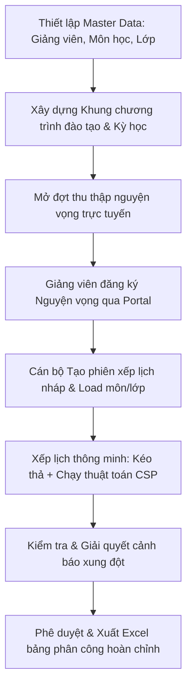

# CHƯƠNG 1. CƠ SỞ LÝ THUYẾT

## 1.1. Giới thiệu

### 1.1.1. Bối cảnh và sự cần thiết của hệ thống quản lý phân công giảng dạy

Trong kỷ nguyên chuyển đổi số và phát triển mạnh mẽ của cách mạng công nghiệp 4.0, việc ứng dụng công nghệ thông tin vào công tác quản trị và vận hành giáo dục đã trở thành một xu thế tất yếu của các trường đại học trên toàn cầu nói chung và tại Việt Nam nói riêng. Một trong những nhiệm vụ cốt lõi và phức tạp nhất trong công tác quản lý đào tạo tại các cơ sở giáo dục đại học chính là lập kế hoạch đào tạo, xếp thời khóa biểu và phân công giảng dạy cho đội ngũ giảng viên. Công việc này không chỉ đòi hỏi sự chính xác tuyệt đối mà còn phải đảm bảo tính tối ưu nhằm cân bằng giữa nguồn lực cơ sở vật chất, năng lực chuyên môn của đội ngũ giảng viên và mục tiêu chất lượng chương trình đào tạo của nhà trường.

Đối với Khoa Công nghệ Thông tin thuộc Trường Đại học Đại Nam, hoạt động giảng dạy mang những đặc thù chuyên ngành sâu sắc và phức tạp hơn rất nhiều so với các khoa đào tạo lý thuyết thuần túy. Chương trình đào tạo ngành Công nghệ Thông tin tại Đại học Đại Nam được thiết kế định hướng ứng dụng thực tiễn cao, do đó hầu hết các học phần chuyên ngành đều được chia làm hai cấu phần rõ rệt: phần giảng dạy Lý thuyết (học tại phòng học truyền thống) và phần giảng dạy Thực hành (học tại các hệ thống phòng máy chuyên dụng). Sự phân tách này dẫn đến việc lập kế hoạch giảng dạy phải đối mặt với bài toán điều phối kép:
- Một môn học cần được bố trí đồng thời cả giảng viên dạy lý thuyết và giảng viên hướng dẫn thực hành chuyên sâu.
- Các học phần thực hành đòi hỏi cấu hình phòng máy chuyên biệt, hệ thống phần mềm cài đặt riêng cho từng môn (như lập trình web, an toàn thông tin, mạng máy tính, trí tuệ nhân tạo).
- Sự khác biệt về định mức giờ giảng và quyền hạn phân công giữa hai nhóm giảng viên: Giảng viên Cơ hữu (đội ngũ nòng cốt, có định mức tiết chuẩn ràng buộc theo quy chế) và Giảng viên Thỉnh giảng (chuyên gia từ các doanh nghiệp, thường có quỹ thời gian bận rộn và thay đổi liên tục).

Thực tế hiện nay tại Khoa Công nghệ Thông tin – Trường Đại học Đại Nam, quy trình thu thập nguyện vọng và phân công giảng dạy vẫn phụ thuộc rất lớn vào các công cụ thủ công truyền thống như bảng tính Excel cá nhân và trao đổi trực tiếp hoặc qua các ứng dụng tin nhắn (Zalo, Email). Cách tiếp cận này bộc lộ những hạn chế và bất cập nghiêm trọng sau:
1. **Quá tải thông tin và dễ xảy ra sai sót:** Việc tổng hợp hàng trăm nguyện vọng của giảng viên cho hàng chục môn học với nhiều lớp học phần khác nhau bằng file Excel rất dễ dẫn đến tình trạng nhầm lẫn số liệu, chéo lịch giảng dạy (một giảng viên bị phân công dạy hai lớp cùng buổi) hoặc chéo lịch lớp học (một lớp bị xếp học hai môn cùng buổi).
2. **Khó kiểm soát định mức và ràng buộc:** Quy chế đào tạo quy định rõ giảng viên cơ hữu phải đạt định mức tiết dạy tiêu chuẩn (160 tiết), đồng thời giới hạn số tiết trần tối đa (250 tiết) để đảm bảo chất lượng bài giảng và sức khỏe của giảng viên. Việc tính toán thủ công lượng giờ giảng quy đổi cho từng người theo thời gian thực khi có sự thay đổi là một thách thức cực kỳ lớn đối với cán bộ giáo vụ khoa.
3. **Thiếu kênh giao tiếp tập trung và minh bạch:** Giảng viên không có một cổng thông tin chuyên dụng để theo dõi trực quan các đợt mở đăng ký nguyện vọng, không thể chủ động đăng ký trực tuyến theo vai trò lý thuyết/thực hành, và gặp khó khăn trong việc phản hồi lịch dạy bận. Điều này làm giảm sự tương tác hai chiều và sự chủ động của giảng viên trong công tác chuẩn bị bài giảng.
4. **Hiệu suất lập kế hoạch thấp:** Mỗi khi có biến động về nhân sự giảng viên hoặc thay đổi khung chương trình từ nhà trường, cán bộ xếp lịch phải thực hiện rà soát lại toàn bộ hệ thống file Excel từ đầu, làm tiêu tốn nhiều ngày làm việc quý báu và dễ gây chậm trễ cho tiến độ chung.

Nhận thức rõ những bất cập trên, việc **"Xây dựng hệ thống lập kế hoạch và giảng dạy cho Khoa Công nghệ Thông tin – Trường Đại học Đại Nam"** là một yêu cầu vô cùng cấp thiết và mang tính đột phá. Hệ thống được xây dựng nhằm mục đích tin học hóa toàn diện quy trình phân công giảng dạy: từ khâu nhập dữ liệu chương trình đào tạo, quản lý hồ sơ giảng viên, mở đợt đăng ký nguyện vọng trực tuyến, xếp lịch tự động hóa dựa trên giải thuật thông minh (CSP), cho đến giao diện kéo thả Workspace trực quan thời gian thực và xuất file báo cáo chuẩn hóa. Đây sẽ là bước tiến quan trọng góp phần hiện đại hóa công tác giáo vụ, tối ưu hóa nguồn lực nhân sự và nâng cao chất lượng đào tạo theo đúng định hướng chuyển đổi số toàn diện của Trường Đại học Đại Nam.

---

### 1.1.2. Lợi ích của hệ thống đối với Nhà trường, Cán bộ quản lý và Giảng viên

Hệ thống lập kế hoạch và giảng dạy sau khi được xây dựng và triển khai thực tế sẽ mang lại những giá trị thặng dư to lớn và lợi ích thiết thực cho ba nhóm đối tượng cốt lõi tham gia vào quy trình đào tạo tại Khoa Công nghệ Thông tin – Trường Đại học Đại Nam:

#### A. Đối với Nhà trường (Trường Đại học Đại Nam)
- **Chuẩn hóa và đồng bộ hóa quy trình quản trị giáo dục:** Hệ thống thiết lập một quy trình phân công giảng dạy chuẩn chỉnh, khoa học và nhất quán. Toàn bộ dữ liệu về chương trình đào tạo, môn học tương đương, danh sách lớp học và hồ sơ năng lực giảng viên được lưu trữ tập trung, hạn chế tối đa việc phân mảnh thông tin giữa các phòng ban.
- **Nâng cao chất lượng đào tạo và giảng dạy:** Bằng việc kiểm soát chặt chẽ các ràng buộc về số lớp tối đa giảng dạy trên một môn học (`O_SUBJECT_FATIGUE`) và giới hạn số giờ giảng tối đa của giảng viên (`O_MAX_HOURS_250`), hệ thống giúp ngăn ngừa tình trạng quá tải cho giảng viên. Đội ngũ giảng viên sẽ có đủ thời gian chuẩn bị giáo án chất lượng cao, từ đó nâng cao hiệu quả tiếp thu kiến thức của sinh viên.
- **Tối ưu hóa nguồn lực cơ sở vật chất:** Hệ thống hỗ trợ phân bổ lịch học tương thích với yêu cầu phòng học (phòng máy chuyên dụng cho thực hành chuyên sâu và phòng học thường cho lý thuyết), hỗ trợ nhà trường giám sát và sử dụng hiệu quả tài nguyên phòng thực hành công nghệ thông tin.
- **Cơ sở dữ liệu động phục vụ báo cáo và kiểm định chất lượng:** Ban giám hiệu và lãnh đạo Khoa có thể nhanh chóng truy xuất các số liệu thống kê trực quan về mật độ giảng dạy của giảng viên cơ hữu/thỉnh giảng, tỷ lệ tải giờ dạy, hỗ trợ tích cực cho công tác đánh giá thi đua khen thưởng và kiểm định chất lượng giáo dục định kỳ của Bộ Giáo dục và Đào tạo.

#### B. Đối với Cán bộ quản lý (Giáo vụ Khoa và Cán bộ xếp lịch)
- **Giải phóng sức lao động, giảm thiểu áp lực công việc:** Cán bộ xếp lịch không còn phải đối mặt với những bảng tính Excel phức tạp dài hàng nghìn dòng. Toàn bộ quy trình thủ công kéo dài nhiều ngày nay được tối ưu hóa chỉ trong vài giờ làm việc trên hệ thống phần mềm hiện đại.
- **Hỗ trợ quyết định thông minh nhờ thuật toán tự động:** Với việc tích hợp động cơ phân công tự động dựa trên **Giải thuật thỏa mãn ràng buộc (CSP - Constraint Satisfaction Problem)**, cán bộ có thể lựa chọn chiến lược phân phối giờ dạy phù hợp (Bão hòa hoặc Cân bằng tải) để hệ thống tự động tính toán và điền đầy 80% thời khóa biểu.
- **Tương tác trực quan và phát hiện xung đột tức thời:** Giao diện Workspace được thiết kế dạng kéo thả mượt mà kết hợp cơ chế kiểm tra ràng buộc tự động. Mỗi khi cán bộ thực hiện thao tác kéo giảng viên vào một buổi dạy, hệ thống sẽ kiểm tra chéo lịch trong tích tắc và hiển thị cảnh báo đỏ nổi bật nếu có hiện tượng chồng chéo lịch (`C_LEC_OVERLAP`, `C_CLASS_OVERLAP`), giúp triệt tiêu hoàn toàn các sai sót chủ quan.
- **Tích hợp Import/Export Excel nhanh chóng:** Cán bộ có thể dễ dàng tải lên khung chương trình đào tạo, danh sách lớp học từ Excel của trường và xuất bản bảng phân công hoàn chỉnh ra file Excel chuẩn hóa chỉ với một cú click chuột, sẵn sàng cho việc công bố rộng rãi.

#### C. Đối với Giảng viên (Giảng viên Cơ hữu và Giảng viên Thỉnh giảng)
- **Cổng thông tin tự phục vụ chuyên nghiệp, thuận tiện:** Giảng viên được cấp tài khoản cá nhân để truy cập cổng thông tin (Lecturer Portal). Tại đây, giảng viên có thể theo dõi trực quan danh sách các đợt nguyện vọng đang mở, chủ động tick chọn môn đăng ký và lựa chọn vai trò giảng dạy (Lý thuyết / Thực hành) phù hợp nhất với thế mạnh chuyên môn của mình.
- **Bảo đảm quyền lợi và sự cân bằng công việc:** Nhờ cơ chế đăng ký lịch bận trực tuyến, giảng viên có thể gửi thông tin về những buổi không thể lên lớp do bận công tác thực tế tại doanh nghiệp (đặc biệt quan trọng với giảng viên thỉnh giảng) để hệ thống tự động loại trừ các slot này trong quá trình phân công.
- **Minh bạch hóa phân công:** Giảng viên có thể xem trực tiếp số tiết dạy đã được gán, đối chiếu trực quan với định mức giờ dạy chuẩn của mình ngay trên hệ thống mà không cần chờ đợi phản hồi hay hỏi đáp thủ công từ giáo vụ khoa, tạo tâm lý thoải mái và nâng cao tinh thần cống hiến cho sự nghiệp giáo dục của nhà trường.

---

## 1.2. Các khái niệm cơ bản

### 1.2.1. Định nghĩa hệ thống quản lý lịch biểu và nguyện vọng giảng dạy

Hệ thống quản lý lịch biểu và nguyện vọng giảng dạy trực tuyến là một giải pháp công nghệ thông tin tích hợp dữ liệu, quy trình và thuật toán, được xây dựng chuyên biệt nhằm tối ưu hóa công tác lập thời khóa biểu và phân công nguồn lực giảng dạy. Về mặt bản chất kỹ thuật, hệ thống hoạt động như một nền tảng quản trị trung tâm kết nối ba thực thể cốt lõi trong môi trường học thuật đại học: Khung chương trình đào tạo (Curriculum), Cơ sở vật chất/Lớp học (Infrastructure/Classes) và Con người (Lecturers).

Hệ thống cho phép tin học hóa toàn diện quy trình phân công giảng dạy thông qua việc thiết lập các mô hình dữ liệu động:
- **Dữ liệu nguyện vọng giảng dạy (Lecturer Preferences):** Tập hợp các thông tin đăng ký chủ động của giảng viên bao gồm các môn học có khả năng giảng dạy tốt nhất, vai trò mong muốn đảm nhận (chỉ dạy lý thuyết, chỉ dạy thực hành, hoặc cả hai), định mức số tiết mong muốn dạy trong kỳ, và các buổi bận cố định không thể lên lớp.
- **Dữ liệu lịch biểu tương tác (Scheduling Session):** Đại diện cho một phiên làm việc cụ thể của cán bộ giáo vụ, chứa danh sách các dòng thời khóa biểu dự kiến phát sinh từ việc kết hợp giữa số lượng lớp học thực tế và khung chương trình đào tạo của từng ngành trong học kỳ hiện tại.

---

### 1.2.2. Các thành phần chính trong quy trình phân công giảng dạy

Quy trình phân công giảng dạy là một chuỗi nghiệp vụ liên tục, có mối quan hệ chặt chẽ từ khâu chuẩn bị dữ liệu đầu vào cho đến khâu phê duyệt và ban hành thời khóa biểu. Một hệ thống lập kế hoạch giảng dạy chuyên nghiệp cần mô phỏng và tự động hóa toàn diện các thành phần này:

```mermaid
graph TD
    A[Thiết lập Master Data: Giảng viên, Môn học, Lớp] --> B[Xây dựng Khung chương trình đào tạo & Kỳ học]
    B --> C[Mở đợt thu thập nguyện vọng trực tuyến]
    C --> D[Giảng viên đăng ký Nguyện vọng qua Portal]
    D --> E[Cán bộ Tạo phiên xếp lịch nháp & Load môn/lớp]
    E --> F[Xếp lịch thông minh: Kéo thả + Chạy thuật toán CSP]
    F --> G[Kiểm tra & Giải quyết cảnh báo xung đột]
    G --> H[Phê duyệt & Xuất Excel bảng phân công hoàn chỉnh]
```

1. **Chuẩn bị và đồng bộ hóa Dữ liệu gốc (Master Data):** Đây là bước nền tảng thiết lập các danh mục thực thể cơ bản trong hệ thống, bao gồm: Danh sách giảng viên (với đầy đủ mã giảng viên, chức vụ, loại hình cơ hữu hay thỉnh giảng), Danh mục môn học (số tín chỉ, số tiết lý thuyết, số tiết thực hành), Danh sách lớp học cố định theo từng khóa (ví dụ: K19) và danh mục phòng máy thực hành.
2. **Quản lý Khung chương trình và Phân bổ kỳ học:** Định nghĩa cấu trúc khung chương trình đào tạo cho từng chuyên ngành thuộc Khoa CNTT. Môn học được định vị chính xác vào từng học kỳ cụ thể (ví dụ: môn Lập trình hướng đối tượng xếp vào học kỳ 3, môn Học máy xếp vào học kỳ 6). Việc ánh xạ này giúp hệ thống tự động nhận diện danh sách môn học cần mở khi cán bộ chọn kỳ học tương ứng.
3. **Mở đợt thu thập nguyện vọng trực tuyến:** Cán bộ xếp lịch thiết lập và công bố đợt đăng ký nguyện vọng gắn liền với học kỳ cụ thể. Hệ thống tự động lọc danh sách môn học khả dụng tương ứng và mở cổng giao tiếp trực tuyến để giảng viên có thể truy cập từ xa.
4. **Giảng viên đăng ký nguyện vọng (Lecturer Portal):** Giảng viên đăng nhập vào hệ thống, xem thông tin mô tả chi tiết của từng môn học được phân công đăng ký, thực hiện tick chọn môn dạy và chọn vai trò giảng dạy lý thuyết (Main) hoặc thực hành (Practice).
5. **Khởi tạo Phiên xếp lịch & Tự động sinh bảng nháp (Scheduling Session):** Cán bộ xếp lịch khởi tạo phiên xếp lịch mới. Hệ thống dựa vào các Khung đào tạo và kỳ học được lựa chọn để tự động đối chiếu cơ sở dữ liệu, sinh ra toàn bộ danh sách các lớp học và các môn học bắt buộc tương ứng, tạo thành các dòng thời khóa biểu trống giảng viên (Timetable Rows).
6. **Xếp lịch thông minh (Kéo thả & Tự động hóa):** Cán bộ thực hiện phân công giảng viên cho từng lớp học bằng hai hình thức phối hợp: chạy thuật toán phân công tự động (Auto-Assignment) để máy tính tự động tìm lời giải tối ưu thỏa mãn các ràng buộc, và kéo thả (Drag and Drop) thủ công các thẻ giảng viên từ bể đề xuất (Lecturer Pool) để tinh chỉnh lịch biểu.
7. **Kiểm soát xung đột và Báo cáo:** Hệ thống liên tục quét dữ liệu phân công để phát hiện các lỗi vi phạm ràng buộc chéo lịch hay vượt quá định mức. Sau khi cán bộ xếp lịch xử lý triệt để các cảnh báo, lịch phân công được khóa lại và xuất ra file Excel chuẩn hóa gửi nhà trường.

---

### 1.2.3. Các tiêu chí, ràng buộc trong việc xếp lịch (Giờ chuẩn, loại giảng viên, số lớp tối đa)

Xếp thời khóa biểu đại diện cho một bài toán tối ưu tổ hợp phức tạp. Để hệ thống có thể hoạt động thực tế và hỗ trợ đắc lực cho cán bộ khoa, các tiêu chí và quy định nghiệp vụ của nhà trường phải được mã hóa thành các ràng buộc kỹ thuật rõ ràng trong mã nguồn:

*   **Giờ chuẩn quy đổi (Theory & Practice Hours):** Mỗi môn học có số tín chỉ khác nhau và được quy đổi thành số tiết giảng dạy thực tế. Ví dụ, môn học có 3 tín chỉ lý thuyết tương ứng với 45 tiết giảng dạy lý thuyết, môn 1 tín chỉ thực hành tương ứng với 30 tiết hướng dẫn thực hành phòng máy. Hệ thống tính toán tổng tải giảng dạy của giảng viên bằng công thức tích lũy số tiết của toàn bộ các lớp được gán:
    $$\text{Tổng giờ giảng} = \sum \text{Giờ lý thuyết môn} + \sum \text{Giờ thực hành môn}$$
*   **Phân nhóm loại Giảng viên (Lecturer Types):**
    - *Giảng viên Cơ hữu (Full-time):* Là đội ngũ nhân sự chịu sự quản lý trực tiếp của trường. Ràng buộc chuẩn hướng đến là định mức tối thiểu phải đạt trong kỳ là 160 tiết (`TARGET_HOURS = 160`) để đảm bảo định mức lao động khoa học của nhà nước.
    - *Giảng viên Thỉnh giảng (Visiting):* Là các chuyên gia, lập trình viên tại các doanh nghiệp đối tác tham gia thỉnh giảng chuyên đề. Giảng viên thỉnh giảng không có ràng buộc định mức tối thiểu nhưng chịu giới hạn nghiêm ngặt về các slot bận (do bận làm việc hành chính tại doanh nghiệp) và định mức trần số tiết thỏa thuận.
*   **Giới hạn số lớp giảng dạy (`MAX_CLASSES_MAIN` & `MAX_SAME_SUBJECT_CLASSES`):**
    Để đảm bảo sức khỏe sư phạm và đa dạng hóa đội ngũ giảng dạy, hệ thống áp đặt giới hạn: một giảng viên chính không được dạy quá 10 lớp học phần trong kỳ học (`MAX_CLASSES_MAIN = 10`), đồng thời không được dạy cùng một môn học cho quá 6 lớp học phần khác nhau (`MAX_SAME_SUBJECT_CLASSES = 6`) nhằm tránh hiện tượng mệt mỏi bài giảng (Subject Fatigue).
*   **Ràng buộc thời gian và tránh chồng chéo (Overlap Constraints):**
    Ràng buộc cứng bắt buộc kiểm tra chéo: Một giảng viên chỉ được xuất hiện tại tối đa một vị trí lớp học trong cùng một buổi dạy (Sáng/Chiều). Tương tự, một lớp học cố định chỉ có thể được xếp tối đa một ca học trong một buổi.

---

### 1.2.4. Các yếu tố ảnh hưởng đến trải nghiệm người dùng trong phân công (Kéo thả, tự động hóa)

Trải nghiệm người dùng (UX) trong các hệ thống quản trị giáo dục truyền thống thường rất nghèo nàn, giao diện phức tạp làm tăng áp lực nhận thức cho người dùng. Trong hệ thống phân công giảng dạy hiện đại, trải nghiệm của cán bộ xếp lịch bị ảnh hưởng sâu sắc bởi hai yếu tố công nghệ tiên tiến:

*   **Thao tác Kéo - Thả trực quan (Drag & Drop UX):** Thay vì phải lựa chọn thủ công qua các ô Dropdown tĩnh nhàm chán và dễ nhầm lẫn, giao diện Workspace hiện đại cung cấp một trải nghiệm tương tác trực quan vượt trội. Cán bộ giáo vụ khoa có thể nhìn thấy danh sách giảng viên dưới dạng các thẻ màu sắc (Card) nằm ở bảng bên phải. Bảng này hiển thị thời gian thực số tiết hiện tại của giảng viên đó. Khi kéo một thẻ giảng viên và di chuyển vào ô giảng viên chính/thực hành của một dòng lớp học phần, hệ thống sẽ tự động kích hoạt các vùng thả (Dropzones) khả dụng, tạo cảm giác mượt mà và trực quan hóa tối đa hành vi phân công.
*   **Tự động hóa thông minh (CSP Solver):** Việc tự xếp thời khóa biểu thủ công cho hàng trăm lớp học phần là một cực hình đối với bộ não con người. Tự động hóa gán lịch thông qua thuật toán thông minh chạy ở backend sẽ làm thay đổi hoàn toàn quy trình này. Giải thuật CSP có khả năng quét qua toàn bộ không gian trạng thái nguyện vọng của giảng viên, đối chiếu lịch bận, kiểm tra định mức tiết chuẩn để đưa ra phương án phân công tối ưu chỉ trong vài giây. Sự kết hợp giữa tự động hóa (máy tính giải quyết 80% khối lượng tổ hợp phức tạp) và kéo thả thủ công (con người tinh chỉnh 20% các trường hợp đặc biệt ngoài thực tế) chính là đỉnh cao của trải nghiệm người dùng hiện đại, nâng tầm hiệu suất làm việc của cán bộ khoa lên gấp nhiều lần.

---

## 1.3. Nghiên cứu các nền tảng phân công hiện nay

### 1.3.1. Các hệ thống quản lý đào tạo và xếp lịch hiện tại

Hiện nay, hầu hết các trường đại học tại Việt Nam đều đã trang bị hệ thống phần mềm Quản lý Đào tạo (thường gọi là Edusoft, UIS, cổng Portal QLĐT). Đây là những hệ thống ERP toàn diện của nhà trường, đảm nhận các tác vụ lớn như quản lý điểm số, đăng ký học tín chỉ của sinh viên, thu học phí và quản lý hồ sơ sinh viên tốt nghiệp. Tuy nhiên, khi đi sâu vào nghiệp vụ lập thời khóa biểu và phân công giảng dạy cho giảng viên khoa, các hệ thống ERP này thường bộc lộ sự thiếu chuyên sâu:
- Việc lập thời khóa biểu trên hệ thống ERP lớn thường diễn ra theo cơ chế phân bổ phòng học cứng nhắc từ trên xuống, không tính đến nguyện vọng cá nhân và lịch bận đặc thù của đội ngũ giảng viên chuyên ngành.
- Các khoa chuyên môn thường phải sử dụng phần mềm xếp thời khóa biểu offline chuyên dụng độc lập như **FET** (phần mềm mã nguồn mở xếp thời khóa biểu tự động rất mạnh) hoặc **aSc Timetables** (phần mềm thương mại của nước ngoài). Các công cụ này giải quyết tốt bài toán xếp slot thời gian dựa trên các thuật toán di truyền (Genetic Algorithm) nhưng lại tách biệt hoàn toàn với cơ sở dữ liệu trực tuyến của nhà trường và không có tính năng quản lý đăng ký nguyện vọng giảng dạy của giảng viên.

---

### 1.3.2. Nhược điểm và hạn chế của các hệ thống truyền thống (Nhập liệu thủ công, khó theo dõi nguyện vọng)

Việc sử dụng các công cụ độc lập, thiếu liên kết hoặc duy trì quy trình thủ công qua Excel gây ra rất nhiều khó khăn thực tế cho Khoa Công nghệ Thông tin:
1. **Thiếu liên kết dữ liệu thời gian thực (Data Silos):** Khi sử dụng các công cụ xếp lịch offline như FET hay aSc Timetables, cán bộ giáo vụ phải trích xuất dữ liệu môn học, lớp học ra file CSV, nạp vào phần mềm xếp lịch, chạy thuật toán ra file kết quả, rồi lại nhập thủ công trở lại hệ thống của trường hoặc chép tay ra Excel để gửi cho giảng viên. Quy trình nhập - xuất thủ công này lặp đi lặp lại rất dễ dẫn đến lỗi đồng bộ và sai lệch thông tin môn học/giảng viên.
2. **Quy trình thu thập nguyện vọng đứt gãy:** Không có kênh giao tiếp trực tuyến đồng bộ. Giảng viên phải gửi file đăng ký nguyện vọng dạy qua Zalo, viết tay hoặc điền biểu mẫu Google Form. Cán bộ giáo vụ sau đó phải căng mắt đọc hàng chục nguồn thông tin khác nhau để tự tay tổng hợp thành file Excel master. Quá trình tổng hợp thủ công này cực kỳ tốn thời gian và là nguồn phát sinh sai sót lớn nhất.
3. **Độ cứng nhắc của thuật toán tự động:** Các phần mềm offline như FET hoạt động theo cơ chế giải thuật chặt chẽ, bắt buộc phải thỏa mãn 100% tất cả các ràng buộc cứng và mềm mới xuất ra được kết quả. Nếu cơ sở dữ liệu đầu vào bị xung đột (ví dụ: thiếu giảng viên khả dụng cho một môn học bắt buộc), thuật toán sẽ bị bế tắc và không thể đưa ra bất kỳ kết quả nào. Hệ thống thiếu một cơ chế phân công lai (Hybrid), cho phép máy tính xử lý phần lớn công việc và con người chủ động can thiệp bằng kéo thả trực quan để gỡ rối các điểm nghẽn cục bộ.

---

### 1.3.3. Ứng dụng công nghệ mới (Kéo thả trực quan, Tự động hóa gán lịch)

Để giải quyết triệt để các nhược điểm trên, xu hướng công nghệ mới hướng tới việc xây dựng các nền tảng Web-based quản trị phân công thế hệ mới. Nền tảng này tích hợp trực tiếp cơ sở dữ liệu trung tâm với hai công nghệ cốt lõi:
- **Công nghệ Kéo thả trực quan trên nền Web (HTML5 Drag & Drop API / React DnD-kit):** Mang lại trải nghiệm thao tác mượt mà, phản hồi tức thời ngay trên trình duyệt web mà không cần cài đặt phần mềm phức tạp dưới máy trạm.
- **Giải thuật tự động thông minh Constraint Satisfaction Problem (CSP):** Được tối ưu hóa bằng các heuristics tìm kiếm tiên tiến (như chọn biến có ràng buộc lớn nhất - MRV, lan truyền ràng buộc - Constraint Propagation). Thuật toán được lập trình chạy trực tiếp ở phía Server dưới dạng các API dịch vụ, cho phép tính toán phương án phân công tối ưu chỉ trong vài tích tắc và tự động trả về cảnh báo chi tiết giúp con người dễ dàng ra quyết định.

---

## 1.4. Yêu cầu bài toán

### 1.4.1. Mô tả bài toán

Bài toán lập kế hoạch giảng dạy và phân công giảng viên cho Khoa Công nghệ Thông tin – Trường Đại học Đại Nam là một bài toán tổ hợp có độ phức tạp rất lớn, ảnh hưởng trực tiếp đến chất lượng giảng dạy của đội ngũ giảng viên và tiến độ học tập của sinh viên. Bản chất cốt lõi của bài toán này là việc tìm kiếm một phương án bố trí, sắp đặt tối ưu nhất để kết nối giữa lực lượng giảng viên hiện có với danh sách các lớp học phần cần mở trong học kỳ, dựa trên khung chương trình đào tạo của từng chuyên ngành. Để giải quyết bài toán một cách thấu đáo, hệ thống cần tiếp nhận một lượng thông tin đầu vào vô cùng đa dạng và phân mảnh. Trước hết là thông tin về các môn học với số lượng tín chỉ lý thuyết và thực hành khác nhau, danh sách các lớp sinh viên theo từng khóa học cụ thể. Song song với đó là cơ sở dữ liệu về đội ngũ giảng viên, phân định rõ ràng giữa lực lượng giảng viên cơ hữu chịu ràng buộc định mức giờ dạy tiêu chuẩn và giảng viên thỉnh giảng từ các doanh nghiệp vốn có quỹ thời gian linh hoạt nhưng lại hạn chế về các ca học bận. Đặc biệt, thông tin nguyện vọng đăng ký trực tuyến của giảng viên bao gồm các môn giảng dạy thế mạnh, vai trò mong muốn đảm nhận giảng dạy lý thuyết hay hướng dẫn thực hành phòng máy và lịch bận cá nhân đóng vai trò là dữ liệu định hướng quan trọng nhất để hệ thống tìm kiếm phương án gán lịch phù hợp.

Mục tiêu cuối cùng của bài toán là sinh ra một bảng phân công thời khóa biểu hoàn chỉnh, nơi mà mỗi lớp học phần của một môn học cụ thể được xác định rõ ca học sáng hoặc chiều, thứ dạy trong tuần, loại phòng học tương thích là phòng học lý thuyết thông thường hay phòng máy thực hành chuyên dụng, và quan trọng nhất là danh tính của giảng viên giảng dạy lý thuyết cùng giảng viên hướng dẫn thực hành phòng máy. Một phương án phân công được coi là khả thi và tối ưu khi nó giải quyết triệt để hai nhóm điều kiện: các ràng buộc cứng bắt buộc phải thỏa mãn tuyệt đối nhằm đảm bảo tính hợp lệ cơ bản của thời khóa biểu như không được chéo lịch giảng viên, không được chéo lịch lớp học, và các ràng buộc mềm mang tính khuyến khích để tối ưu hóa trải nghiệm giảng dạy cũng như tuân thủ tốt nhất quy chế đào tạo của nhà trường như đạt định mức giờ dạy của giảng viên cơ hữu và không gây mệt mỏi bài giảng do dạy quá nhiều lớp cùng một môn học.

---

### 1.4.2. Yêu cầu chức năng

Hệ thống được thiết kế hướng tới việc xây dựng một nền tảng quản trị phân công toàn diện, thân thiện và dễ sử dụng cho mọi đối tượng tham gia vào quy trình đào tạo của Khoa. Điểm khởi đầu của hệ thống là khả năng đồng bộ và quản trị dữ liệu gốc một cách nhanh chóng và chính xác. Cán bộ quản lý có thể dễ dàng khởi tạo, chỉnh sửa hoặc loại bỏ thông tin của giảng viên, môn học, lớp học cố định và khung chương trình đào tạo của từng chuyên ngành. Để tiết kiệm thời gian và giảm thiểu thao tác nhập liệu thủ công tẻ nhạt, hệ thống hỗ trợ chức năng nạp dữ liệu hàng loạt từ các file bảng tính Excel sẵn có của trường. Khi thông tin giảng viên mới được thêm vào hệ thống, một tài khoản đăng nhập cá nhân sẽ được tự động kích hoạt, đồng thời phân quyền tương ứng với vai trò của họ để đảm bảo tính an toàn và bảo mật thông tin.

Sau khi chuẩn bị đầy đủ dữ liệu gốc cho học kỳ mới, cán bộ xếp lịch có thể thiết lập và công bố các đợt thu thập nguyện vọng giảng dạy trực tuyến. Việc đóng hoặc mở cổng đăng ký được thực hiện vô cùng linh hoạt và dễ dàng thông qua giao diện điều khiển trung tâm. Về phía các giảng viên, khi đăng nhập vào cổng thông tin cá nhân dành riêng cho mình, họ sẽ được tiếp cận một giao diện đăng ký trực quan và khoa học. Giảng viên có thể xem danh sách các môn học được mở trong kỳ học hiện tại, chủ động lựa chọn đăng ký giảng dạy những môn học phù hợp với năng lực chuyên môn, đồng thời xác định rõ vai trò mong muốn là dạy lý thuyết chính hay hướng dẫn thực hành phòng máy. Hơn nữa, giảng viên có thể cập nhật trực tiếp thời gian biểu cá nhân để thông báo cho giáo vụ biết những buổi bận cố định trong tuần, giúp hệ thống tự động loại trừ và tránh xếp lịch vào các ca học đó, tạo sự chủ động tối đa cho giảng viên trong công tác sắp xếp công việc riêng.

Trọng tâm và là tính năng đột phá nhất của hệ thống nằm ở không gian làm việc xếp lịch thời khóa biểu tương tác. Tại phân hệ này, cán bộ giáo vụ khoa được cung cấp một trình thuật sĩ thông minh hỗ trợ tạo nhanh các phiên xếp lịch nháp dựa trên việc lựa chọn khung chương trình đào tạo và kỳ học cụ thể, hệ thống sẽ tự động đối chiếu cơ sở dữ liệu để kéo ra tất cả các cặp lớp môn cần phân công mà không sợ bỏ sót bất kỳ môn học bắt buộc nào. Giao diện Workspace được thiết kế hiện đại, chia tách rõ ràng giữa danh sách lớp môn cần xếp lịch và bể chứa thẻ thông tin của giảng viên khả dụng ở bảng bên phải. Cán bộ quản lý có thể phân công giảng dạy bằng cách chạy động cơ xếp lịch tự động dựa trên thuật toán thông minh phía Backend. Thuật toán này có khả năng tự động phân tích hàng ngàn tổ hợp điều kiện để điền đầy phần lớn thời khóa biểu chỉ trong vài tích tắc, hỗ trợ cả hai chiến lược phân bổ là tập trung tối đa cho giảng viên hoặc phân chia đều đặn nhằm đảm bảo tính công bằng. Sau khi máy tính đưa ra bộ khung lịch biểu cơ bản, cán bộ có thể sử dụng thao tác kéo thả vô cùng mượt mà để di chuyển các thẻ giảng viên vào ô phân công, thực hiện tinh chỉnh các trường hợp đặc biệt ngoài thực tế. Trong suốt quá trình tương tác kéo thả này, hệ thống liên tục thực hiện rà soát thông tin để phát hiện các lỗi xung đột lịch biểu và hiển thị cảnh báo trực quan bằng màu sắc nổi bật ngay tại dòng thời khóa biểu bị lỗi, giúp cán bộ giáo vụ nhận diện và xử lý xung đột ngay lập tức trước khi xuất bản bản phân công chính thức ra file Excel chuẩn hóa gửi nhà trường.

---

### 1.4.3. Yêu cầu phi chức năng

Bên cạnh các phân hệ chức năng nghiệp vụ, hệ thống lập kế hoạch giảng dạy cũng cần phải đáp ứng các tiêu chuẩn khắt khe về mặt phi chức năng để bảo đảm sự ổn định và tin cậy trong suốt quá trình vận hành thực tế. Trước hết là yêu cầu về hiệu năng xử lý và tốc độ phản hồi của hệ thống. Các tác vụ thông thường như truy vấn, cập nhật danh mục hay đăng ký nguyện vọng phải được thực hiện gần như tức thời để mang lại cảm giác mượt mà cho người dùng. Đặc biệt, thuật toán tự động phân công giảng dạy vốn xử lý một khối lượng tính toán tổ hợp cực kỳ lớn phải được tối ưu hóa để hoàn thành nhiệm vụ chỉ trong vòng vài giây, tránh gây ra tình trạng nghẽn mạng hay treo trình duyệt web của cán bộ xếp lịch. Đồng thời, hệ thống phải được thiết kế có cấu trúc linh hoạt để dễ dàng mở rộng quy mô phần cứng và phần mềm, đảm bảo khả năng đáp ứng tốt khi số lượng lớp học phần hoặc số lượng giảng viên thỉnh giảng tăng cao trong các kỳ học cao điểm của nhà trường.

Tính an toàn và bảo mật dữ liệu cũng là một yếu tố sống còn đối với một hệ thống quản lý thông tin nhà trường. Toàn bộ thông tin nhạy cảm của người dùng như mật khẩu tài khoản phải được mã hóa bảo mật phía Backend bằng các thuật toán băm một chiều hiện đại trước khi lưu trữ vào cơ sở dữ liệu. Hệ thống triển khai cơ chế xác thực và phân quyền nghiêm ngặt dựa trên mã thông báo JSON Web Token được đính kèm an toàn trong mỗi yêu cầu từ Frontend, giúp kiểm soát chặt chẽ quyền truy cập và đảm bảo giảng viên hay cán bộ quản lý chỉ có thể thao tác đúng phạm vi chức năng được cấp phép. Ngoài ra, giao diện của hệ thống được đầu tư thiết kế tỉ mỉ, tuân thủ các quy chuẩn mỹ thuật web hiện đại. Việc sử dụng các tông màu hài hòa, bố cục trực quan rõ ràng cùng phông chữ hệ thống hiện đại, dễ đọc giúp giảm bớt căng thẳng và mệt mỏi cho cán bộ giáo vụ trong những ngày làm việc cường độ cao. Giao diện cũng được tối ưu hóa để hiển thị tốt trên các trình duyệt phổ biến hiện nay, đảm bảo trải nghiệm đồng nhất và chuyên nghiệp nhất cho người sử dụng.

---

## 1.5. Kết luận chương

Chương 1 đã thiết lập một nền tảng cơ sở lý thuyết vững chắc và toàn diện cho đề tài **"Xây dựng hệ thống lập kế hoạch và giảng dạy cho Khoa Công nghệ Thông tin – Trường Đại học Đại Nam"**. Thông qua việc phân tích bối cảnh giáo dục hiện đại và những đặc thù chuyên sâu trong công tác giảng dạy chuyên ngành công nghệ thông tin tại Trường Đại học Đại Nam, chương này đã làm nổi bật tính cấp thiết vượt trội của việc tin học hóa quy trình phân công giảng dạy. 

Nghiên cứu cũng đã chỉ rõ các khái niệm cốt lõi, mô phỏng quy trình nghiệp vụ chuẩn hóa, định nghĩa chi tiết hệ thống các ràng buộc kỹ thuật cứng và mềm (như chéo lịch giảng viên, chéo lịch lớp học, giờ tiết chuẩn quy đổi, giới hạn định mức tiết dạy tiêu chuẩn) làm nền tảng cho việc lập trình thuật toán xếp lịch tự động. Đồng thời, việc đánh giá nhược điểm của các phần mềm xếp lịch offline truyền thống đã khẳng định tính đột phá của giải pháp tích hợp giao diện kéo thả trực quan thời gian thực (Drag & Drop) kết hợp động cơ phân công tự động CSP thông minh trên môi trường Web-based. 

Từ các yêu cầu chi tiết về mặt chức năng và phi chức năng đã được xác lập cụ thể trong chương này, chương tiếp theo sẽ tập trung phân tích sâu vào kiến trúc các công nghệ, framework hiện đại được lựa chọn ứng dụng nhằm hiện thực hóa giải pháp phần mềm tối ưu cho nhà trường.
